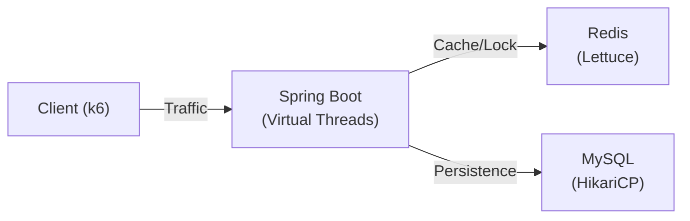

# Concurrency Control PoC: High-Traffic Inventory System

> **이커머스 재고 시스템의 대규모 트래픽 처리를 위한 동시성 제어 전략 검증 프로젝트**
>
> 5,000명의 동시 접속자가 100개의 한정 수량을 경쟁하는 **선착순 이벤트(Hot Deal)** 상황에서, 데이터 정합성을 보장하면서 최대의 성능을 내는 최적의 아키텍처를 엔지니어링 관점에서 탐구했습니다.

[](https://openjdk.org/)
[](https://spring.io/projects/spring-boot)
[](https://redis.io/)
[](https://www.mysql.com/)
[](https://k6.io/)

---

## 🏆 Executive Summary (핵심 성과)

격리된 테스트 환경(Isolated Environment)에서 4가지 동시성 제어 기법을 정량적으로 비교한 결과, **Redis Lua Script**가 모든 지표에서 압도적인 우위를 점했습니다.

| 시나리오 | 최적 방식 (Best Practice) | 달성 성과 | 핵심 요인 |
| :--- | :--- | :--- | :--- |
| **선착순 이벤트**<br>(5,000 VUs 경합) | 🥇 **Lua Script** | **10,539 TPS**<br>(Latency 1.0s) | • **Lock-free:** 락 대기 시간 제거<br>• **Fast Fail:** 재고 소진 시 즉시 응답 |
| **최대 처리량**<br>(재고 10,000개) | 🥇 **Lua Script** | **1,583 TPS**<br>(Latency 120ms) | • **I/O 최소화:** DB 접근 없이 메모리 연산<br>• **원자성:** 스크립트 실행의 Atomic 보장 |
| **안정성 임계점**<br>(RPS 1,000) | 🥇 **Lua Script** | **Latency 3ms** | • **리소스 효율:** 2 vCPU로 2,000 RPS 방어 |

> **결론:** 대규모 트래픽 환경에서는 **Redis Lua Script**를 도입하여 DB 부하를 0으로 만들고 처리량을 극대화해야 합니다.
>
> 📄 **[상세 성능 분석 리포트 보기 (Performance V2)](docs/reports/performance-v2.md)**

---

## 🏗️ 아키텍처 및 기술적 접근

**"어떻게 동시성을 제어할 것인가?"**에 대한 4가지 해답을 구현하고 비교했습니다.

| 방식 | 기술 스택 | 특징 | Trade-off |
| :--- | :--- | :--- | :--- |
| **Pessimistic Lock** | MySQL `FOR UPDATE` | 데이터 정합성 최우선 | 동시성 저하 (직렬 처리) |
| **Optimistic Lock** | JPA `@Version` | 락 없이 버전 관리 | 충돌 시 재시도 비용 발생 |
| **Distributed Lock** | Redisson (Pub/Sub) | 분산 환경 락 제어 | 네트워크 RTT 오버헤드 |
| **Lua Script** | Redis `EVAL` | **서버 사이드 원자성** | 스크립트 관리 필요 |

### System Architecture


---

## 🧪 테스트 엔지니어링 (Test Engineering)

단순한 부하 주입이 아닌, **목적에 맞는 검증 시나리오**를 설계하여 데이터의 신뢰성을 확보했습니다.

### 1. 격리성 (Isolation)
- **문제:** 이전 테스트의 잔재(Connection Pool, Cache)가 다음 테스트에 영향을 줌.
- **해결:** `make clean && make up` 파이프라인을 통해 매 테스트 직전 인프라를 **Cold Start** 상태로 초기화.

### 2. 시나리오 세분화
- **Capacity Test:** 재고가 넉넉할 때(10k) 시스템이 처리할 수 있는 최대 TPS 측정. → **[리포트](docs/reports/capacity-report.md)**
- **Contention Test:** 재고가 부족한(100개) 핫딜 상황에서 5,000명 동시 접속 시 안정성 검증. → **[리포트](docs/reports/contention-report.md)**
- **Stress Test:** 부하를 점진적으로 늘려가며 응답 속도가 급증하는 임계점(Knee Point) 탐색. → **[리포트](docs/reports/stress-report.md)**

### 3. 최적화 (Optimization)
- **Virtual Threads:** Java 21 가상 스레드 도입으로 I/O 블로킹 비용 최소화.
- **OS Tuning:** `ulimit`, `sysctl` 튜닝으로 10,000+ Connection 수용.

---

## 📊 성능 분석 (Performance Deep Dive)

### 왜 Redis Distributed Lock은 느린가?
- **관찰:** 1,000 RPS 부하에서 p95 Latency가 **33ms**로 급증 (타 방식 3ms 대비 10배).
- **원인:** 락을 획득(`lock`)하고 해제(`unlock`)하는 과정에서 **최소 2번 이상의 네트워크 왕복(RTT)**이 발생합니다. 트래픽이 몰릴수록 이 네트워크 비용이 누적되어 병목을 유발합니다.

### 왜 Lua Script는 압도적인가?
- **관찰:** 2,000 RPS 부하에서도 Latency **2.7ms** 유지.
- **원인:** 로직 전체를 Redis 서버로 전송하여 한 번에 실행합니다. **네트워크 왕복을 1회로 줄이고**, Redis의 싱글 스레드 특성을 이용해 **락 없이도 원자성을 보장**하므로 컨텍스트 스위칭 비용이 없습니다.

---

## 🚀 실무 도입 가이드 (Recommendation)

테스트 결과를 바탕으로 상황별 최적의 기술을 제안합니다.

1.  **초고부하 핫딜 (티켓팅):** 👉 **Lua Script**
    - 고민할 필요 없이 Lua Script를 사용하세요. 인프라 비용 대비 최고의 효율을 냅니다.
2.  **일반적인 주문/결제:** 👉 **Pessimistic Lock**
    - 트래픽이 예측 가능하고 데이터 정합성이 중요하다면, DB 락이 가장 구현하기 쉽고 확실한 방법입니다.
3.  **충돌이 적은 수정 요청:** 👉 **Optimistic Lock**
    - 동시 수정이 드문 게시판이나 정보 수정에는 낙관적 락이 가볍고 빠릅니다.

---

## ⚡ Quick Start

프로젝트를 로컬에서 즉시 실행해볼 수 있습니다.

```bash
# 1. 인프라 실행
make up

# 2. 애플리케이션 빌드
make build

# 3. Capacity Test 실행 (Lua Script 모드)
make test-capacity METHOD=lua-script
```

---

## 📚 문서 (Documentation)

- **[Performance Report V2](docs/reports/performance-v2.md)**: 최종 성능 분석 리포트
- **[Practical Guide](docs/reports/practical-guide.md)**: 실무 적용 가이드
- **[Architecture](docs/architecture/system-overview.md)**: 시스템 설계도
- **[k6 Study](docs/technology/k6-study.md)**: 부하 테스트 방법론

---

### 👨‍💻 Author
**JuJin** (Backend Engineer)
> "데이터로 증명하고, 자동화로 해결합니다."