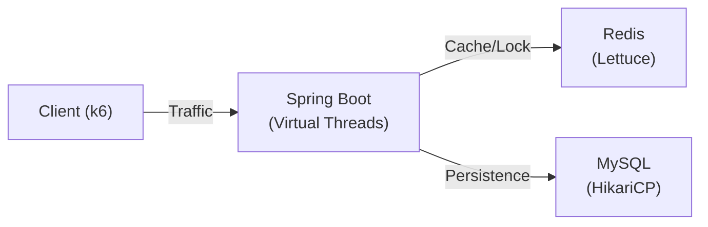
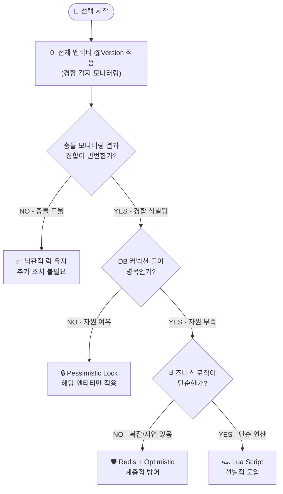

# Concurrency Control PoC: High-Traffic Inventory System

> **이커머스 재고 시스템의 대규모 트래픽 처리를 위한 동시성 제어 전략 검증 프로젝트**
>
> "은탄환은 없다. 적재적소(Right Tool for Right Job)만 있을 뿐." — 4가지 동시성 제어 방식을 각각의 **Best Fit 시나리오**에서 검증하여, 기술의 우열이 아닌 **상황에 따른 최적 선택**을 실제 성능으로 증명했습니다.

[](https://openjdk.org/)
[](https://spring.io/projects/spring-boot)
[](https://redis.io/)
[](https://www.mysql.com/)
[](https://k6.io/)

---

## 🏆 Executive Summary (핵심 성과)

4가지 동시성 제어 기법을 **상황별 Best Fit 시나리오**에서 검증한 결과, 절대적인 우승자는 없으며 비즈니스 맥락에 따라 최적 선택이 달라짐을 정량적으로 증명했습니다.

| 시나리오 | 우승자 | 핵심 인사이트 |
|:---|:---|:---|
| **복합 트랜잭션** (50 VUs, 고경합) | **Pessimistic Lock** | 자원 낭비 제로, 실질 처리량 1위 |
| **저경합 분산 환경** (100 VUs, 100 상품) | **Pessimistic Lock** | TPS 차이 2.8%에 불과, 성공률 100% |
| **고부하 자원 보호** (500 VUs, DB Pool 10) | **Redis + Optimistic** | Fail-fast로 DB 커넥션 보호 |
| **극한 성능** (500 VUs, No Delay) | **Lua Script** | 독보적 3,491 TPS, 단 비즈니스 로직 제약 |

> **결론:** 비관적 락을 기본으로 시작하고, 낙관적 락(`@Version`) 충돌 모니터링으로 경합 지점을 식별한 뒤, 인프라 자원이 부족해지는 시점에 Redis를 도입하라.
>
> 📄 **[상세 성능 분석 리포트 (Performance V3)](docs/reports/performance-v3.md)** | [V2 (Sprint 5-6 기록)](docs/reports/performance-v2.md)

---

## 🏗️ 아키텍처 및 기술적 접근

**"어떻게 동시성을 제어할 것인가?"**에 대한 4가지 해답을 구현하고 비교했습니다.

| 방식 | 기술 스택 | 특징 | Trade-off |
| :--- | :--- | :--- | :--- |
| **Pessimistic Lock** | MySQL `FOR UPDATE` | 데이터 정합성 최우선 | 동시성 저하 (직렬 처리) |
| **Optimistic Lock** | JPA `@Version` | 락 없이 버전 관리 | 충돌 시 재시도 비용 발생 |
| **Distributed Lock** | Redisson (Pub/Sub) | 분산 환경 락 제어 | 네트워크 RTT 오버헤드 |
| **Lua Script** | Redis `EVAL` | **서버 사이드 원자성** | 단순한 비즈니스 로직에만 적용 가능 |

### System Architecture


---

## 🧪 테스트 엔지니어링 (Test Engineering)

단순한 부하 주입이 아닌, **목적에 맞는 검증 시나리오**를 설계하여 데이터의 신뢰성을 확보했습니다.

### 1. 격리성 (Isolation)
- **문제:** 이전 테스트의 잔재(Connection Pool, Cache)가 다음 테스트에 영향을 줌.
- **해결:** `reset-infra`(Docker 완전 재시작) 파이프라인을 통해 매 테스트 직전 인프라를 **Cold Start** 상태로 초기화.

### 2. Best Fit 시나리오 (Sprint 7)
각 방식이 가장 빛나는 시나리오를 설계하여, 기술의 우열이 아닌 상황에 따른 최적 선택을 검증했습니다.

- **Scenario 1: Complex Transaction** — 복합 ACID 트랜잭션에서 비관적 락의 안정성 검증 → **[리포트](docs/reports/1-complex-transaction-report.md)**
- **Scenario 2: Low Contention** — 저경합 분산 환경에서 낙관적 락 vs 비관적 락 종합 비교 → **[리포트](docs/reports/2-low-contention-report.md)**
- **Scenario 3: Resource Protection** — 고부하(500 VUs)에서 Redis 계층적 방어의 필요성 증명 → **[리포트](docs/reports/3-resource-protection-report.md)**
- **Scenario 4: Extreme Performance** — 비즈니스 지연 제거 시 순수 기술 오버헤드 비교 → **[리포트](docs/reports/4-extreme-performance-report.md)**

### 3. 절대 비교 시나리오 (Sprint 5-6)
동일 조건에서 4가지 방식을 절대적으로 비교하여 각 기술의 기본 특성을 파악했습니다.

- **Capacity Test:** 재고가 넉넉할 때(10k) 최대 TPS 측정 → **[리포트](docs/reports/capacity-report.md)**
- **Contention Test:** 재고 부족(100개) 핫딜 상황에서 5,000명 동시 접속 → **[리포트](docs/reports/contention-report.md)**
- **Stress Test:** 부하 점진 증가, 임계점(Knee Point) 탐색 → **[리포트](docs/reports/stress-report.md)**

### 4. 최적화 (Optimization)
- **Virtual Threads:** Java 21 가상 스레드 도입으로 I/O 블로킹 비용 최소화.
- **의도적 자원 제한:** DB Pool 10으로 제한하여 자원 부족 상황을 유도, 각 방식의 병목 특성을 극대화하여 관찰.

---

## 📊 핵심 인사이트 (Key Insights)

### 1. 통념 검증: "낙관적 락이 비관적 락보다 빠르다"는 조건부 명제

- 저경합(100상품 분산) 환경에서 낙관적 락(89.36 TPS)이 비관적 락(86.95 TPS)보다 겨우 **2.8% 높았을 뿐**이며, 재시도 3회를 포함하면 오히려 **비관적 락에 역전**(83.50 vs 86.95 TPS).
- 충돌률이 5%에 불과한 환경에서도 재시도를 도입하는 순간 [로직 재수행 + 커넥션 재획득 + 네트워크 RTT] 비용이 누적되어 낙관적 락의 '락 없음' 이점이 완전히 상쇄됨.
- **결론:** "낙관적 락이 빠르다"는 명제는 **재시도가 거의 작동하지 않을 때만 미세하게 성립**하는 조건부 명제. 실무에서 실패를 허용하지 않는다면 비관적 락이 성능까지 앞섬.

### 2. 각 방식의 본질적 가치: 성능이 아닌 역할로 이해하라

**낙관적 락 — 경합 감지 모니터링 도구 (0순위 기본값)**
- `@Version`은 "빠르기 때문에" 쓰는 것이 아니라, **"어디서 경합이 발생하는지 알려주기 때문에"** 쓰는 것.
- `ObjectOptimisticLockingFailureException` 발생 빈도를 모니터링하면 비관적 락을 적용할 엔티티를 자연스럽게 식별할 수 있음. 5%의 충돌률이 바로 **"이 엔티티에 비관적 락이 필요하다"**는 신호.
- 같은 트래픽 대비 DB 커넥션을 아껴 쓰는 **커넥션 효율성**이 숨겨진 핵심 가치. 100 VUs에서는 미미하지만, 500+ VUs에서 결정적 차이를 만듦.

**비관적 락 — 자원 낭비 제로의 안정적 표준 (1순위 타겟 솔루션)**
- 성공률 100%의 진짜 의미: 모든 DB 커넥션이 **비즈니스 가치를 생산**함. 낙관적 락의 재시도는 이전 커넥션 사용이 "헛수고"가 되는 자원 낭비.
- 복합 트랜잭션(재고 차감 + 포인트 사용 + 결제 이력)에서 **실질 처리량 1위**, 저경합 환경에서도 성능/안정성/구현 단순성 **종합 1위**.
- 단, **Easy to Use, Hard to Master** — JPA `@Lock`은 간편하지만, MySQL Gap Lock, PostgreSQL Advisory Lock 등 RDBMS별 락 특성을 반드시 이해해야 함.

**Lua Script — 도입의 정당성은 TPS가 아니라 DB 커넥션 보호**
- Lua Script를 위해 도메인 로직을 간소화하면, 동일하게 간소화된 로직을 비관적 락으로 실행해도 **26.7배 TPS 향상**(36→978 TPS).
- 즉, 단순히 TPS를 높이려면 **로직 간소화만으로 충분**. Lua Script의 진짜 가치는 DB 커넥션을 사용하지 않고 Redis에서 원자적으로 처리하여 **DB 자원을 근본적으로 보호**하는 것.

### 3. 비즈니스 로직 지연에 따른 순위 반전

- 100ms 지연 시: Redis+Optimistic **1위** (154 TPS) vs Pessimistic **최하위** (36 TPS)
- 0ms 지연 시: Pessimistic **2위** (978 TPS) vs Redis Lock **최하위** (602 TPS)
- **결론:** 기술 선택은 벤치마크가 아니라 **비즈니스 로직의 복잡도**에 의해 결정되어야 함. 동일 기술이라도 비즈니스 맥락에 따라 1위도 꼴찌도 될 수 있음.

### 4. 인프라 자원이 기술 선택을 결정한다

**커넥션 풀 설정이 성능 천장을 결정**
- DB Pool 50 환경: 비관적 락만으로 충분, Redis 도입은 네트워크 홉만 추가하여 오히려 성능 저하.
- DB Pool 10 환경: 비관적 락의 p95가 13.48s로 폭증, Redis 계층적 방어가 필수(p95 3.29s).
- **결론:** 서버를 늘리기 전에 `application.yml`의 `maximum-pool-size` 튜닝이 먼저. 커넥션 풀 하나가 아키텍처 선택을 좌우함.

**Redis 도입의 정당한 시점**
- 자원이 여유로운 환경에서 Redis를 도입하면 **관리 비용만 증가**. 비관적 락이 충분히 동작하는 환경에서 섣불리 도입하지 마라.
- **트래픽 대비 인프라 자원이 부족해지기 시작할 때**가 Redis를 꺼내야 할 시점.

**Redis 보호 계층이 필요한 이유: 커넥션 풀은 "우리의 책임"**
- 본 프로젝트에서 Redis를 앞에 둔 근본적 이유는 TPS가 아니라 **RDBMS의 커넥션 풀이라는 고정된 자원을 보호**하기 위해서임.
- RDBMS, MongoDB 등 **커넥션 풀 기반 DB**를 직접 운영하는 경우, 커넥션 풀 크기 산정과 고갈 방지는 전적으로 엔지니어의 책임. 이것이 Redis 계층적 방어가 존재하는 이유.
- 반면 DynamoDB, Firestore 등 **HTTP API 기반 관리형 서비스**는 커넥션 풀 개념이 없어 이 보호 계층 자체가 불필요함. 병목 관리를 서비스 제공자에게 위임(과금)한 것.
- **병목이 사라진 것이 아니라, 누가 관리하느냐의 차이.** 관리형 서비스는 돈으로 위임하고, 자체 운영은 엔지니어링으로 해결한다.

### 5. 동시성 제어는 쓰기 최적화의 출발점

- 동시성 제어는 본질적으로 **쓰기 최적화(Write Optimization)** — 같은 데이터에 동시에 쓰려는 요청을 안전하고 효율적으로 처리하는 문제.
- 본 프로젝트는 RDBMS 락 기반 전략을 검증했지만, 쓰기 최적화의 세계는 더 넓음: NoSQL(Cassandra LWW, DynamoDB Conditional Write), Redis 자료구조(Set 멱등성, Sorted Set 순서 보장), CQRS/Event Sourcing 등.
- **상황에 맞는 도구를 선택하는 것**이 핵심이며, 본 프로젝트의 인사이트는 그 판단력의 기초.

---

## 🛡️ 실무 도입 전략 (Engineering Insights)

### 점진적 최적화 흐름 (Progressive Optimization)

```
전체 엔티티 @Version 적용 (경합 감지 모니터링)
        ↓
낙관적 락 충돌 모니터링 (신호 감지)
        ↓
경합 빈번 엔티티 식별 (분석)
        ↓
해당 엔티티만 비관적 락 적용 (타겟 솔루션)
        ↓
트래픽 증가 시 Redis 계층 추가 (스케일)
```

### 의사결정 가이드 (Decision Tree)



상세 가이드: **[Practical Guide](docs/reports/practical-guide.md)**

---

## 🚀 프로젝트 마일스톤 (Milestones)

- [x] **Sprint 0-2:** 4가지 동시성 제어 방식 구현 및 인프라 구축
- [x] **Sprint 3-5:** k6 기반 부하 테스트 및 한계 돌파 (Virtual Threads 최적화)
- [x] **Sprint 6:** **심화 연구 (Deep Dive)** - 실무 사례 분석 및 운영 가이드 집대성
- [x] **Sprint 7:** **상황별 최적화 검증 (Best Fit Verification)** - "은탄환은 없다"를 4가지 시나리오로 증명

---

## ⚡ Quick Start

프로젝트를 로컬에서 즉시 실행해볼 수 있습니다.

```bash
# 1. 인프라 실행
make up

# 2. 애플리케이션 빌드
make build

# 3. Scenario 1: Complex Transaction - Pessimistic Lock (인프라 초기화 + 워밍업 자동 포함)
make test-complex-pessimistic
```

### 다른 시나리오 실행

| 시나리오 | 명령어 | 상세 |
|:---|:---|:---|
| **1. Complex Transaction** | `make test-complex-pessimistic` | [리포트](docs/reports/1-complex-transaction-report.md) |
| **2. Low Contention** | `make test-low-contention-pessimistic` | [리포트](docs/reports/2-low-contention-report.md) |
| **3. Resource Protection** | `make test-resource-protection-redis-optimistic` | [리포트](docs/reports/3-resource-protection-report.md) |
| **4. Extreme Performance** | `make test-extreme-lua` | [리포트](docs/reports/4-extreme-performance-report.md) |

---

## 📚 문서 (Documentation)

- **[Performance Report V3](docs/reports/performance-v3.md)**: 상황별 최적화 검증 통합 리포트 (Sprint 7)
- **[Performance Report V2](docs/reports/performance-v2.md)**: 절대 비교 성능 리포트 (Sprint 5-6)
- **[Practical Guide](docs/reports/practical-guide.md)**: 실무 적용 가이드
- **[Architecture](docs/architecture/system-overview.md)**: 시스템 설계도
- **[k6 Study](docs/technology/k6-study.md)**: 부하 테스트 방법론

---

### 👨‍💻 Author
**JuJin** (Backend Engineer)
> "데이터로 증명하고, 자동화로 해결합니다."