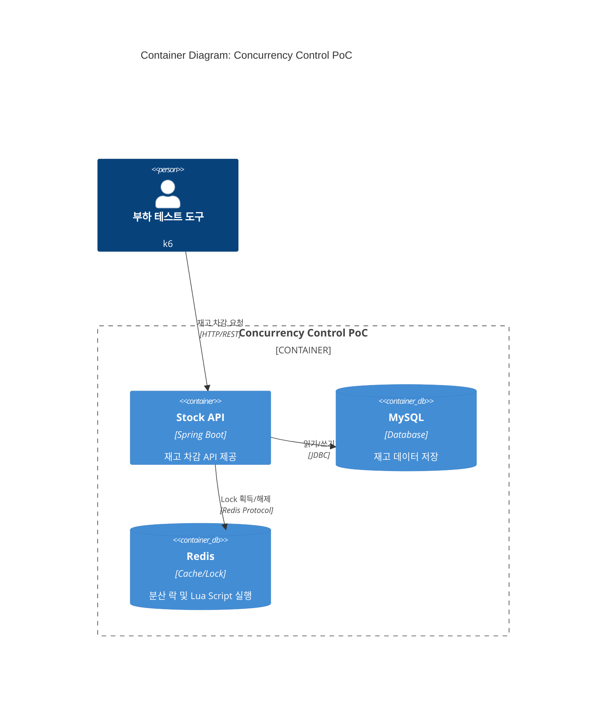
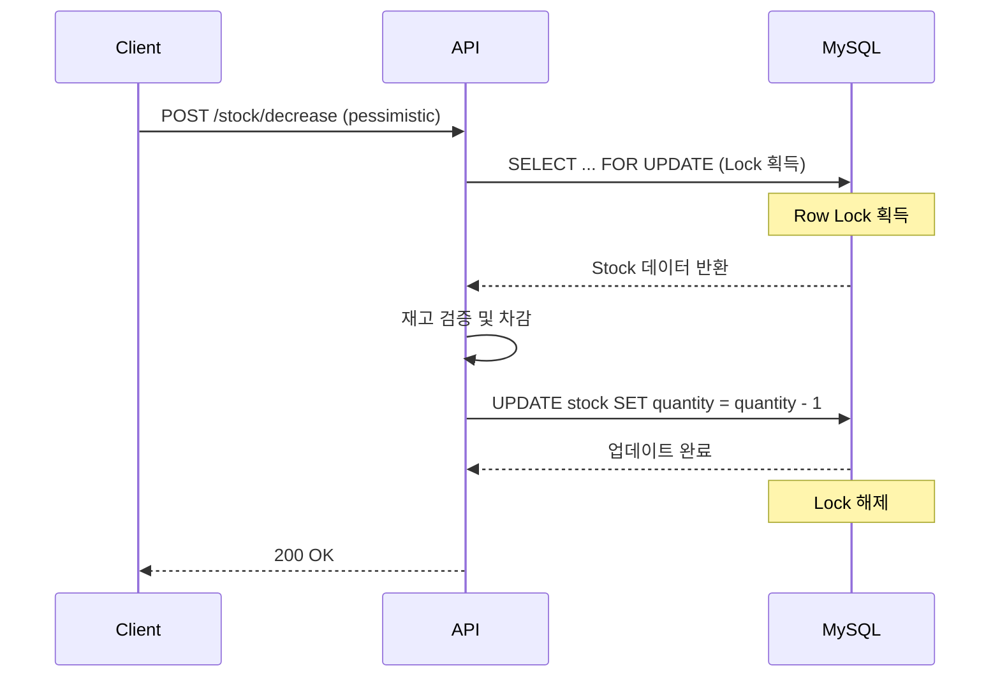
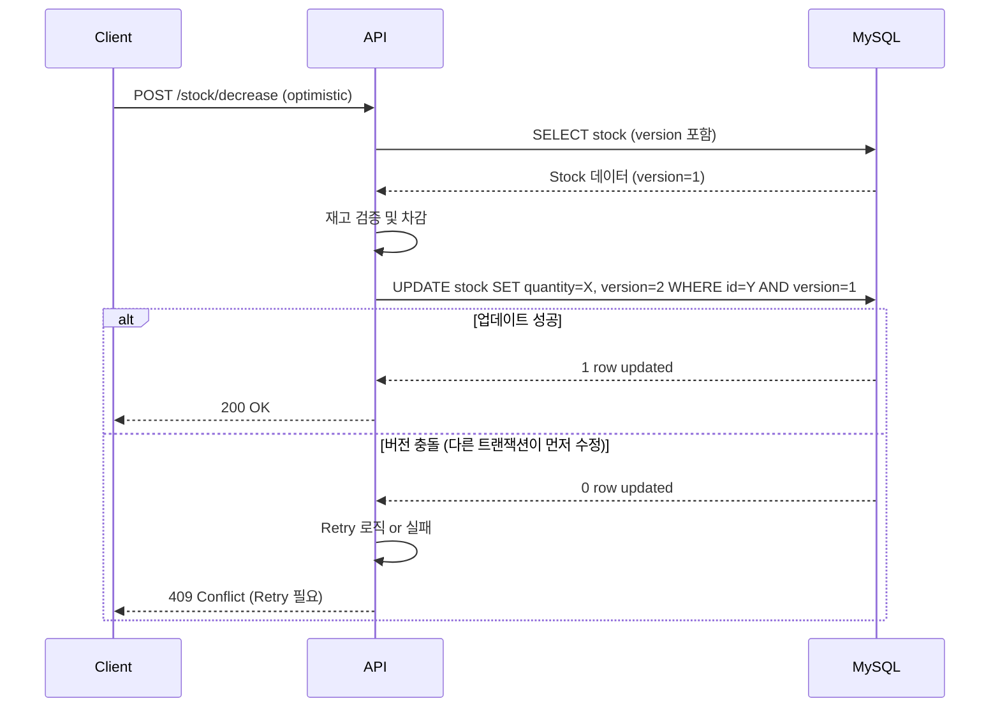
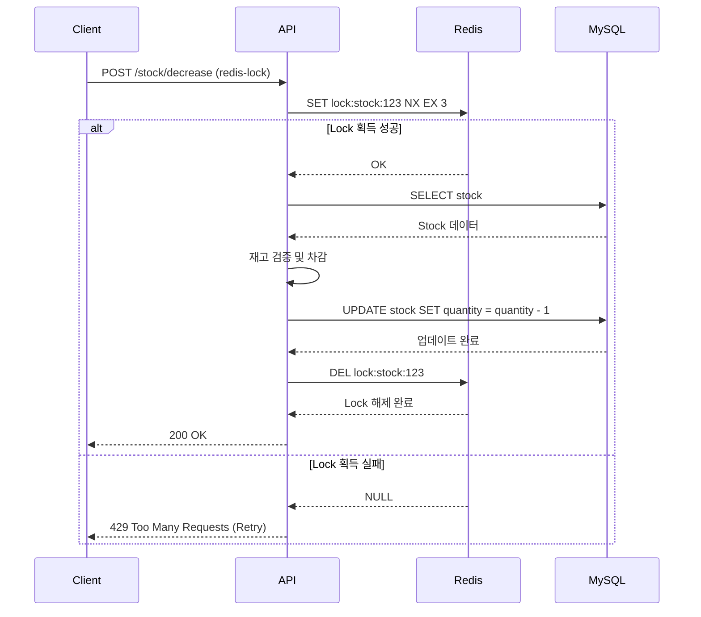
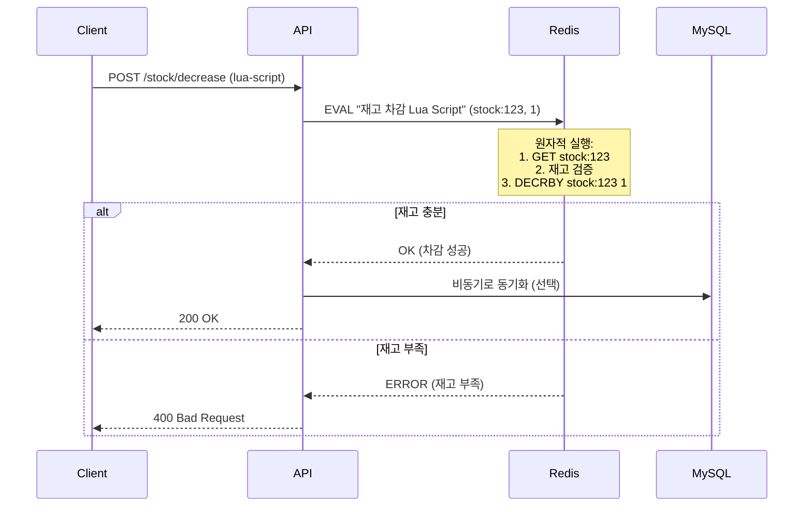
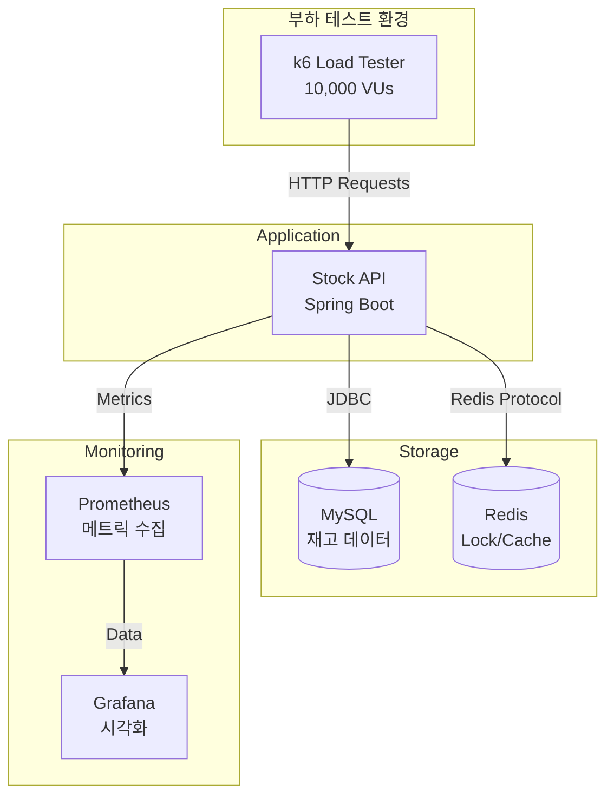
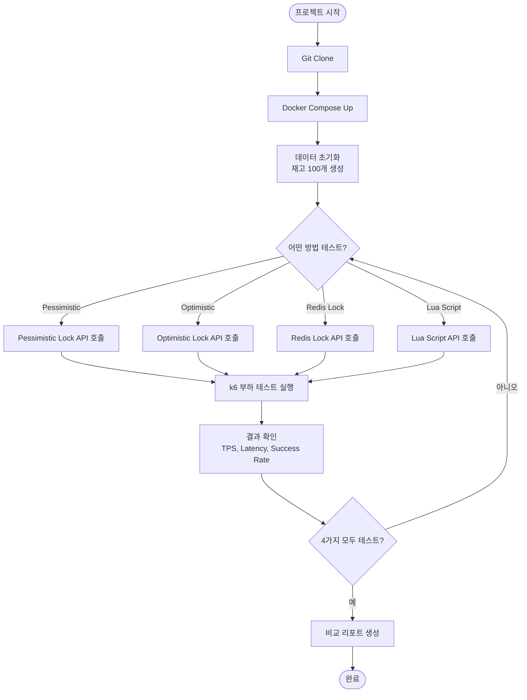

# 대규모 트래픽 처리 (이직용 기술 포트폴리오)

**문제 정의 시작:** 2025-12-30
**재정의 완료:** 2026-01-05
**현재 상태:** PoC 범위 확정 (동시성 제어 집중)

---

## 첫 접근 (How부터 시작한 실수)

### 초기 계획 1차: "대규모 데이터 처리 = MSA"
- **목표:** 대규모 데이터 처리 경험 쌓기
- **동기:** 대기업 백엔드 팀 입사 요구사항
- **첫 로드맵:** 모듈형 모놀리스 → MSA 전환

**문제점:**
- ❌ **"대규모 데이터 처리 = MSA"라고 착각**
- ❌ **What(대규모 데이터 처리가 정확히 무엇?)은 정의 안 함**
- ❌ **How(MSA)부터 시작**

**1차 재정의 결과:**
- "대규모 데이터"를 해체: 경쟁 상태 / 빅데이터 / 조회 최적화 / EDA
- MSA는 도메인 분리지 대규모 데이터 처리가 아님을 인지

---

### 초기 계획 2차: "3가지 기술 모두 구현"
- **선정 기술:** 경쟁 상태 + 조회 최적화 + EDA
- **근거:**
  - 경쟁 상태: AI 추천 (대규모 트래픽의 핵심)
  - EDA: 최신 아키텍처 기본 소양
  - 조회 최적화: 전통적 대규모 처리 기술

**문제점:**
- ❌ **3가지를 다 하려다 보니 각각이 얕아질 위험**
- ❌ **범위가 너무 큼** (실제로 필요한 것이 무엇인지 불명확)
- ❌ **"대규모 트래픽 처리"와 "빅데이터 처리"의 차이도 불명확**

---

### 초기 계획 3차: time-deal-service 프로젝트
- **프로젝트:** Time-Deal Service (모듈러 모놀리스)
- **구조:**
  - 3개 도메인 (Product, Order, Payment)
  - 헥사고날 아키텍처 + DDD
  - ArchUnit 테스트
  - 4개 Sprint 계획 (청사진 → 도메인 → 동시성 → Kafka)

**문제점:**
- ❌ **예상 기간: 3-4달** (제약 조건: 1-2달)
- ❌ **목적과 범위 불일치:** 토이 프로젝트인데 MVP 수준 범위
- ❌ **완성 가능성 낮음:** 헥사고날 학습 + Kafka 셋업 시간 과다
- ❌ **"넓지만 얕음" 위험:** 4개 Sprint를 다 하려다 각각이 얕아짐

---

## 2W: What & Why 재정의

### What 질문: 이게 정확히 무엇인가?

**모호한 초기 정의:**
> "대규모 데이터 처리 경험을 쌓고 싶다"

**질문을 통한 명확화:**
- Q: "내 실제 수요는 무엇인가?"
  - A: **수요는 없다. 이직 시장 증명용 쇼케이스다.**

- Q: "비즈니스 문제를 해결하는 건가?"
  - A: **아니다. 기술 검증 토이 프로젝트다.**

- Q: "대규모 트래픽 처리인가, 빅데이터 처리인가?"
  - A: **대규모 트래픽 처리 (Concurrency, 실시간 처리)**
  - **빅데이터 처리는 데이터 엔지니어 영역**

**최종 What 정의:**
✅ **"이직용 기술 검증 토이 프로젝트 (1-2달, 동시성 제어 PoC)"**

---

### Why 질문: 왜 해야 하는가?

#### 1. 타겟 회사 및 포지션
- **회사:** 네카라쿠배 + 뱅크샐러드, 모요, 채널코퍼레이션
- **포지션:** 시니어 백엔드 엔지니어
- **JD 키워드:** "대규모 트래픽 처리 경험"

#### 2. 증명 방식
- **GitHub:** 재현 가능한 코드
- **블로그:** 기술 비교 + 정량 지표 (주 타겟: 동료 개발자)
- **정량 지표:** TPS, Latency 측정 결과
- → 자연스럽게 면접 설명 연결

#### 3. 시간 제약
- **기간:** 1-2달
- **이유:** 길게 할 생각 없음, 범위 제한 필요

#### 4. 깊이 vs 넓이
- **선택:** 1-2개 기술을 깊게 > 3가지 모두 얕게
- **이유:** 전문성 증명, 완성 가능성, 실무 적용 가능한 데이터

---

### 산업/도메인 탐색

#### "대규모 트래픽 처리" 정의 (산업 리서치 결과)

**대규모 트래픽 처리 (Large-Scale Traffic Handling)**
> "시스템 가용성의 범위를 넘었을 때의 대응 경험"

- **핵심:** 로드 밸런싱, 동시성 제어, 실시간 처리
- **목표:** 서비스 안정성, 응답 속도
- **기술:** 캐시, 메시지 큐, DB Lock, Redis Lock

**빅데이터 처리 (Big Data Processing) - 제외**
> "대량의 데이터 분석, OLAP, ETL"

- **핵심:** 데이터 마이닝, 복잡한 쿼리, 배치 처리
- **목표:** 데이터 인사이트 추출
- **기술:** Hadoop, Spark, 데이터 파이프라인
- **결론:** 데이터 엔지니어 영역, 백엔드 엔지니어 역량과 다름

#### 타겟 회사들의 실제 문제

**네이버:**
- "대규모 트래픽과 대용량 데이터를 처리하는 시스템을 효율적으로 개발 및 관리"
- 핵심: **성능 + 안정성**

**쿠팡:**
- 마이크로서비스 아키텍처
- 쿠팡이츠: **실시간 주문 배정 (초 단위 계산)**
- 핵심: **실시간 처리, MSA**

**뱅크샐러드 (핀테크):**
- Go + gRPC (4년간 베스트 프랙티스)
- 마이크로서비스 환경
- 핵심: **데이터 정합성 + 동시성** (돈이 걸려있음)

**토스:**
- ["서버 증설 없이 처리하는 대규모 트래픽"](https://toss.tech/article/monitoring-traffic)
- 핵심: **비용 효율 + 성능 최적화**

**공통점:**
- ✅ 동시성 제어
- ✅ 실시간 처리
- ✅ 성능 최적화 (캐시, Lock)
- ❌ EDA는 "있으면 좋지만 필수 아님"
- ❌ 복잡한 아키텍처보다 **"문제를 어떻게 해결했는가"**가 중요

---

### 이론과 실무의 갭

**초기 가설:**
- 경쟁 상태 (동시성) ✅
- 조회 최적화 (캐싱) ⚠️ (다들 Redis 쓴다고 함, 차별화 어려움)
- EDA (최신 아키텍처) ⚠️ (모든 회사가 쓰는 것은 아님)

**리서치 후 재검증:**
- **동시성 제어가 핵심!**
- 핀테크/커머스 공통: 재고, 포인트, 좌석 등 동시성 문제
- 블로그/면접에서 가장 어필 가능

**범위 재조정 필요:**
- ❌ 3가지 모두 → 각각 얕아짐
- ✅ 동시성 제어 하나만 → 극도로 깊게

---

## 1H: How (PoC 범위 확정)

### PoC (Proof of Concept) 전략

**목표:**
> "재고 차감 동시성 제어 4가지 방법 성능 비교"

**범위 (1-1.5달):**
1. **단일 도메인:** Stock (재고) 관리만
2. **단일 기능:** 재고 차감 (데이터 정합성 보장)
3. **4가지 구현 방법:**
   - Method 1: Pessimistic Lock (DB 비관적 락)
   - Method 2: Optimistic Lock (DB 낙관적 락)
   - Method 3: Redis Distributed Lock (분산 락)
   - Method 4: Redis Lua Script (원자적 연산)

---

### 프로젝트 구조 (단순화)

```
concurrency-control-poc/
├── src/
│   ├── domain/
│   │   └── Stock.java              # 재고 Aggregate
│   ├── service/
│   │   ├── PessimisticLockService.java
│   │   ├── OptimisticLockService.java
│   │   ├── RedisLockService.java
│   │   └── RedisLuaScriptService.java
│   ├── repository/
│   │   ├── StockRepository.java    # JPA
│   │   └── RedisStockRepository.java
│   └── controller/
│       └── StockController.java    # 통합 API
├── tests/
│   ├── unit/                       # 단위 테스트
│   └── archunit/                   # 아키텍처 테스트
├── k6-scripts/
│   ├── pessimistic-lock-test.js
│   ├── optimistic-lock-test.js
│   ├── redis-lock-test.js
│   └── lua-script-test.js
├── docs/
│   ├── performance-test-result.md  # 부하 테스트 결과 그래프
│   ├── comparison.md               # 4가지 방법 장단점 비교
│   └── setup-guide.md              # 재현 가이드
└── docker-compose.yml              # MySQL + Redis
```

---

### 아키텍처 단순화

**제거:**
- ❌ 멀티 모듈 (Product, Order, Payment 분리) → 단일 모듈로 충분
- ❌ 헥사고날 아키텍처 → 레이어드 아키텍처로 충분
- ❌ Kafka/EDA → 동시성 검증에 방해됨

**유지:**
- ✅ DDD (Stock Aggregate)
- ✅ ArchUnit (아키텍처 규칙 강제 - 가성비 좋음)
- ✅ JUnit 5 (단위 테스트)

---

### 아키텍처 다이어그램 (시각화)

**목적:**
- 블로그 포스팅 자료
- 스터디/온보딩 자료
- 면접 설명 자료

#### 1. C4 Container Diagram (시스템 전체 구성)



**설명:**
- 단일 Spring Boot 애플리케이션
- MySQL: 재고 데이터 영속화
- Redis: 분산 락 + Lua Script 실행
- k6: 부하 테스트 도구

---

#### 2. Sequence Diagram: 4가지 동시성 제어 방법

**2-1. Pessimistic Lock (비관적 락)**



**특징:**
- DB Row Lock 사용
- 다른 트랜잭션은 Lock이 해제될 때까지 대기
- 데이터 정합성 100% 보장
- Lock Contention 높음

---

**2-2. Optimistic Lock (낙관적 락)**



**특징:**
- Version 컬럼 사용
- Lock 없이 업데이트 시도
- 충돌 시 Retry 필요
- TPS 높지만 Success Rate 낮을 수 있음

---

**2-3. Redis Distributed Lock (분산 락)**



**특징:**
- Redis의 SET NX (Not eXists) 사용
- DB와 독립적인 Lock
- TTL 설정으로 Deadlock 방지
- 분산 환경에서도 사용 가능

---

**2-4. Redis Lua Script (원자적 연산)**



**특징:**
- Redis 내에서 모든 연산 완료
- DB 접근 없이 초고속 처리
- Lock 없이도 원자성 보장
- 가장 높은 TPS

---

#### 3. 부하 테스트 Architecture



---

#### 4. 온보딩 Flow Diagram



---

### 정량 측정 계획

**부하 테스트 도구:** k6

**측정 지표:**
1. **TPS (Transactions Per Second):** 초당 처리 가능한 요청 수
2. **Latency:** 응답 시간 (p50, p95, p99)
3. **성공률:** 데이터 정합성 (재고가 음수가 되지 않는가?)
4. **동시 사용자:** 100명, 1000명, 10000명 시뮬레이션

**비교 시나리오:**
- 시나리오 1: 재고 100개, 동시 요청 1000개
- 시나리오 2: 재고 100개, 동시 요청 10000개
- 시나리오 3: 장시간 안정성 테스트 (10분간 지속 트래픽)

**결과 형식:**
```
| Method            | TPS   | p95 Latency | Success Rate | Lock Contention |
|-------------------|-------|-------------|--------------|-----------------|
| Pessimistic Lock  | 1,200 | 85ms        | 100%         | High            |
| Optimistic Lock   | 3,500 | 45ms        | 92%          | Low (Retry)     |
| Redis Lock        | 5,000 | 30ms        | 100%         | Medium          |
| Lua Script        | 8,000 | 20ms        | 100%         | None            |
```

---

### 블로그 포스팅 구성

**제목:**
> "재고 차감 동시성 제어 4가지 방법 성능 비교: Pessimistic vs Optimistic vs Redis Lock vs Lua Script"

**구성:**
1. **문제 정의**
   - 100개 재고에 10,000개 요청이 동시에 들어오는 상황
   - Race Condition으로 인한 재고 음수 발생 재현

2. **4가지 해결 방법**
   - 각 방법의 동작 원리
   - 코드 예시 (핵심 부분만)
   - 장단점

3. **성능 테스트 결과**
   - k6 부하 테스트 그래프
   - TPS/Latency 비교 표
   - 동시 사용자별 성능 변화

4. **실무 적용 가이드**
   - 어떤 상황에 어떤 방법을 쓸 것인가?
   - 트레이드오프 분석

5. **재현 방법**
   - GitHub 링크
   - Docker Compose로 즉시 실행 가능

---

### Sprint 계획

**참고:**
- 각 Sprint는 "기간"이 아닌 "목표와 산출물" 중심
- AI 협업으로 빠르게 진행 가능 (일주일 안에도 가능)
- 완료 기준: 산출물이 명확하고 검증 가능

---

#### Sprint 0: 플랫폼 엔지니어링 + 아키텍처 설계

**Goal:** 비기능적 요구사항 충족 + 아키텍처 시각화

**Task:**
1. **플랫폼 엔지니어링**
   - Docker Compose 작성 (MySQL + Redis)
   - 데이터 초기화 스크립트 (재고 100개 생성)
   - Makefile 작성 (`make init`, `make up`, `make down`)
   - 로컬 개발 환경 검증

2. **아키텍처 설계 및 시각화**
   - C4 Container Diagram (시스템 전체 구성)
   - Sequence Diagram 4종 (각 Lock 방식별 동작 흐름)
   - 부하 테스트 Architecture Diagram
   - 온보딩 Flow Diagram

3. **ADR 작성**
   - ADR-001: 왜 이 4가지 방법을 비교하는가?
   - ADR-002: 왜 PoC 범위로 축소했는가?

4. **프로젝트 스캐폴딩**
   - Spring Boot 프로젝트 생성
   - 패키지 구조 설계
   - ArchUnit 테스트 작성 (아키텍처 규칙 강제)

**산출물:**
- ✅ Docker Compose 실행 가능
- ✅ 4개 Mermaid 다이어그램 완성
- ✅ 2개 ADR 문서
- ✅ 빈 프로젝트 구조 + ArchUnit 테스트 통과

**완료 기준:**
- `make up` 실행 시 MySQL + Redis 정상 동작
- 다이어그램을 보고 누구나 시스템 이해 가능
- ArchUnit 테스트 실행 시 pass

---

#### Sprint 1: DB Lock 구현 (Pessimistic + Optimistic)

**Goal:** MySQL 기반 동시성 제어 2가지 구현 및 검증

**Task:**
1. **Stock Domain 모델**
   - Stock Aggregate 구현 (DDD)
   - 비즈니스 불변식 (재고는 0 이상)
   - 단위 테스트 작성

2. **Pessimistic Lock 구현**
   - `@Lock(LockModeType.PESSIMISTIC_WRITE)` 사용
   - StockService 구현
   - 통합 테스트 작성 (동시성 시뮬레이션)

3. **Optimistic Lock 구현**
   - `@Version` 컬럼 추가
   - Retry 로직 구현
   - 충돌 시나리오 테스트

4. **REST API 구현**
   - `POST /api/stock/decrease?method=pessimistic`
   - `POST /api/stock/decrease?method=optimistic`
   - API 문서 작성 (Swagger)

**산출물:**
- ✅ Stock Domain + 단위 테스트 100% 커버리지
- ✅ 2가지 Lock 방식 구현 완료
- ✅ 통합 테스트 통과 (동시 요청 시나리오)
- ✅ Swagger UI에서 API 호출 가능

**완료 기준:**
- 100명이 동시에 요청해도 재고가 정확히 차감됨
- Pessimistic: 100% Success Rate (느림)
- Optimistic: Retry 발생, Success Rate 측정

---

#### Sprint 2: Redis 구현 (Distributed Lock + Lua Script)

**Goal:** Redis 기반 동시성 제어 2가지 구현 및 검증

**Task:**
1. **Redis Distributed Lock 구현**
   - Redisson 라이브러리 사용
   - `RLock` 기반 재고 차감
   - TTL 설정 (Deadlock 방지)
   - Lock 획득 실패 시 Retry 로직

2. **Redis Lua Script 구현**
   - Lua Script 작성 (재고 차감 원자적 연산)
   - Redis Template 연동
   - Script 로드 및 실행
   - MySQL 비동기 동기화 (선택)

3. **REST API 확장**
   - `POST /api/stock/decrease?method=redis-lock`
   - `POST /api/stock/decrease?method=lua-script`

4. **비교 테스트**
   - 4가지 방법 모두 동일 조건 테스트
   - 예비 성능 비교 (간단한 JMeter 테스트)

**산출물:**
- ✅ Redis Lock + Lua Script 구현 완료
- ✅ 4가지 방법 모두 작동
- ✅ API 통합 테스트 통과
- ✅ 예비 성능 비교 데이터

**완료 기준:**
- 4가지 API 모두 Postman/Swagger로 호출 가능
- Lua Script가 가장 빠름을 직관적으로 확인

---

#### Sprint 3: 부하 테스트 + 성능 비교 분석

**Goal:** k6 부하 테스트로 정량 지표 측정 및 비교

**Task:**
1. **k6 스크립트 작성**
   - 4개 파일 작성 (각 방법별)
   - 시나리오: 재고 100개, 동시 요청 1000/10000개
   - Ramp-up 설정 (점진적 부하 증가)

2. **부하 테스트 실행**
   - 각 방법별 3회 이상 반복 측정
   - TPS, Latency (p50/p95/p99), Success Rate 수집
   - 시스템 리소스 모니터링 (CPU, Memory)

3. **결과 분석 및 시각화**
   - 비교 표 작성 (Markdown)
   - 그래프 생성 (TPS 비교, Latency 분포)
   - 장단점 분석 문서 작성

4. **성능 리포트 작성**
   - `docs/performance-test-result.md`
   - 각 방법의 Trade-off 정리
   - 실무 적용 가이드

**산출물:**
- ✅ 4개 k6 스크립트
- ✅ 성능 비교 표 + 그래프
- ✅ 성능 리포트 문서
- ✅ 실무 적용 가이드

**완료 기준:**
- 정량 지표 측정 완료 (TPS, Latency, Success Rate)
- "어떤 상황에 어떤 방법을 쓸 것인가" 명확히 정리됨

**예상 결과 (가설):**
| Method            | TPS   | p95 Latency | Success Rate | 적합한 상황 |
|-------------------|-------|-------------|--------------|------------|
| Pessimistic Lock  | 1,200 | 85ms        | 100%         | 강한 정합성 필요 |
| Optimistic Lock   | 3,500 | 45ms        | 92%          | 충돌 적고 재시도 가능 |
| Redis Lock        | 5,000 | 30ms        | 100%         | 분산 환경, 빠른 처리 |
| Lua Script        | 8,000 | 20ms        | 100%         | 초고속, DB 동기화 불필요 |

---

#### Sprint 4: 문서화 + 블로그 + 온보딩 자료

**Goal:** 프로젝트 완성 및 외부 공개 준비

**Task:**
1. **README 작성**
   - 프로젝트 소개
   - Quick Start (Docker Compose)
   - API 사용 예시
   - 부하 테스트 실행 방법

2. **블로그 포스팅 작성**
   - 제목: "재고 차감 동시성 제어 4가지 방법 성능 비교"
   - 구성:
     1. 문제 정의 (Race Condition 재현)
     2. 4가지 해결 방법 설명 (코드 + 다이어그램)
     3. 성능 테스트 결과 (그래프)
     4. 실무 적용 가이드
     5. GitHub 링크

3. **온보딩 자료 작성**
   - 스터디용 발표 자료 (PPT or Notion)
   - 온보딩 Flow Diagram 기반 가이드
   - "30분 만에 따라하기" 튜토리얼

4. **GitHub 정리**
   - 코드 리팩토링 (주석 정리)
   - 불필요한 파일 제거
   - 태그 생성 (v1.0.0)
   - GitHub Actions CI 설정 (선택)

**산출물:**
- ✅ README.md 완성
- ✅ 블로그 포스팅 초안
- ✅ 온보딩 가이드 (스터디용)
- ✅ GitHub 공개 가능 상태

**완료 기준:**
- 다른 사람이 README만 보고 프로젝트 실행 가능
- 블로그 글을 읽고 4가지 방법의 차이 이해 가능
- 스터디원이 30분 안에 온보딩 완료 가능

---

#### Sprint 5 (선택): 확장 및 고도화

**Goal:** 추가 가치 제공 (선택 사항)

**Option 1: 모니터링 추가**
- Prometheus + Grafana 연동
- 실시간 대시보드 구축
- 부하 테스트 중 시스템 메트릭 시각화

**Option 2: 조회 최적화 PoC 추가**
- RDBMS vs Redis vs DynamoDB 비교
- 두 번째 블로그 포스팅

**Option 3: 비동기 처리 추가**
- Kafka 연동
- Event-Driven 재고 차감
- 세 번째 블로그 포스팅

**완료 기준:**
- 하나를 완벽하게 완성한 후 시간이 남으면 진행

---

### 확장 가능성

**완성 후 선택 사항:**
1. **조회 최적화 추가** (RDBMS vs Redis vs DynamoDB)
2. **비동기 처리 추가** (Kafka를 활용한 재고 이벤트)
3. **모니터링 추가** (Grafana + Prometheus)

**하지만 핵심은:**
- ✅ **하나를 완벽하게 완성**
- ✅ **정량 지표와 함께**
- ✅ **재현 가능하게**

---

## 회고

### 잘못된 점

1. ❌ **How(MSA, 3가지 기술, 복잡한 아키텍처)부터 시작**
2. ❌ **What(정확히 무엇을 증명할 것인가)을 명확히 하지 않음**
3. ❌ **모호한 용어("대규모 데이터 처리")를 그대로 사용**
4. ❌ **타겟 회사들의 실제 필요를 리서치하지 않음**
5. ❌ **토이 프로젝트인데 MVP 수준의 범위 계획**
6. ❌ **시간 제약(1-2달)과 범위(3-4달) 불일치**

---

### 배운 점

1. ✅ **What을 먼저 명확히 해야 함**
   - "대규모 데이터 처리" → "이직용 동시성 제어 PoC"
   - "학습 프로젝트" → "기술 검증 토이 프로젝트"

2. ✅ **모호한 용어는 해체 필요**
   - "대규모 데이터" → 경쟁 상태 / 빅데이터 / 조회 최적화 / EDA
   - "대규모 트래픽 처리" ≠ "빅데이터 처리"

3. ✅ **산업 리서치가 필수**
   - 타겟 회사 기술 블로그 분석
   - JD 키워드의 진짜 의미 파악
   - "동시성 제어"가 핵심임을 발견

4. ✅ **범위는 제약 조건에 맞춰야 함**
   - 1-2달 제약 → PoC 범위
   - MVP보다 PoC가 토이 프로젝트에 적합
   - "넓고 얕게" < "좁고 깊게"

5. ✅ **완성 가능성이 최우선**
   - 미완성 복잡한 프로젝트 < 완성된 단순 프로젝트
   - 정량 지표 + 재현 가능성 = 차별화

---

### 핵심 교훈

> **"대규모 트래픽 처리"라는 모호한 목표는 존재하지 않는다.**
> **"재고 차감 시 동시성 제어를 4가지 방법으로 검증하고 성능을 비교한다"처럼 구체적으로 정의해야 올바른 범위 산정이 가능하다.**

> **토이 프로젝트는 MVP가 아니라 PoC다.**
> **완성 가능한 작은 범위에서 기술적 깊이를 극대화하는 것이 이직용 포트폴리오의 핵심이다.**

> **What/Why 없이 How부터 시작하면 방향을 잃는다.**
> **"왜 3가지를 다 해야 하는가?"라는 질문에 명확한 답이 없다면, 범위를 줄여야 한다.**

---

### Why(왜 해야 하는가) 최종 정리

**이직 시장 요구:**
- 대규모 회사 JD: "대규모 트래픽 처리 경험"
- 실제 의미: 동시성 제어, 성능 최적화, 안정성

**증명 방식:**
- GitHub: 재현 가능한 4가지 구현
- 블로그: 성능 비교 + 정량 지표
- 면접: "이렇게 측정하고 비교했습니다" (데이터 기반 설명)

**범위 산정:**
- 1-2달 완성 가능
- 동시성 제어 하나만 깊게
- 확장 가능성 유지

---

## 다음 스텝

### 즉시 시작 가능: Sprint 0

**첫 작업:**
1. **프로젝트 생성**
   - `concurrency-control-poc` 디렉터리 생성
   - Git 초기화
   - Spring Boot 프로젝트 스캐폴딩

2. **플랫폼 엔지니어링**
   - Docker Compose 작성
   - Makefile 작성
   - 로컬 환경 검증

3. **아키텍처 시각화**
   - 4개 Mermaid 다이어그램 작성
   - docs 디렉터리에 저장
   - README에 링크

4. **ADR 작성**
   - ADR-001: 왜 이 4가지 방법인가?
   - ADR-002: 왜 PoC 범위인가?

**Sprint 0 완료 후:**
→ Sprint 1 시작 (DB Lock 구현)

---

**최종 업데이트:** 2026-01-05
**상태:** ✅ What/Why/How 재정의 완료, PoC 범위 확정, Sprint 계획 수립
**다음:** Sprint 0 시작 (플랫폼 엔지니어링 + 아키텍처 설계)
