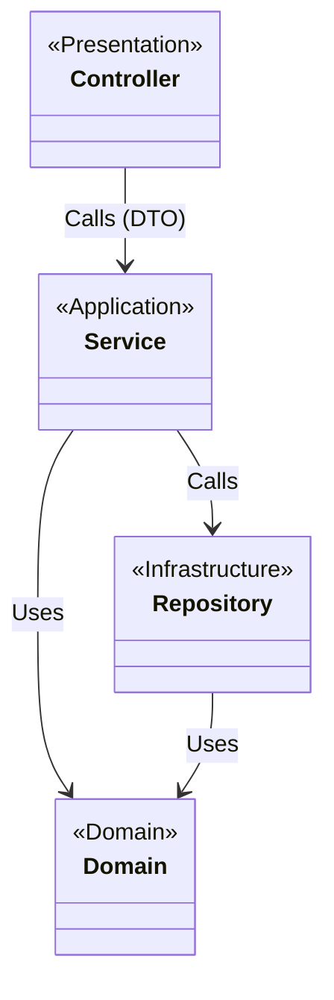

# 애플리케이션 아키텍처

## 개요

이 문서는 Concurrency Control PoC 프로젝트의 애플리케이션 아키텍처와 패키지 구조를 설명합니다.
**Layered Architecture**를 기반으로 하며, ArchUnit을 통해 의존성 규칙을 강제합니다.

## 1. 패키지 구조

```
src/main/java/com/concurrency/poc/
├── controller/       # Presentation Layer (Web Adapter)
├── service/          # Application Layer (Business Logic)
├── domain/           # Domain Layer (Entity)
└── repository/       # Infrastructure Layer (Data Access)
```

### 계층별 역할

| 계층 | 패키지 | 역할 | 의존성 규칙 |
|------|--------|------|------------|
| **Presentation** | `controller` | HTTP 요청/응답 처리, 파라미터 검증, DTO 변환 | → `service` (DTO 사용) |
| **Application** | `service` | 트랜잭션 관리, 도메인 로직 호출, 흐름 제어 | → `repository`, `domain` |
| **Infrastructure** | `repository` | 데이터베이스 접근 (Spring Data JPA) | → `domain` |
| **Domain** | `domain` | 핵심 비즈니스 로직 및 상태 (Entity) | 의존성 없음 (POJO) |

---

## 2. 의존성 규칙 (ArchUnit)

우리는 컴파일 타임이 아닌 **테스트 타임**에 아키텍처 규칙을 검증합니다.



### 금지된 의존성 (위반 시 테스트 실패)
- ❌ **Controller → Domain:** 컨트롤러는 도메인 엔티티를 직접 알면 안 됨 (DTO 필수).
- ❌ **Controller → Repository:** 컨트롤러가 리포지토리를 직접 호출하면 안 됨.
- ❌ **Domain → Service/Repository:** 도메인 객체는 인프라나 서비스 로직을 알면 안 됨.
- ❌ **Repository → Controller:** 역방향 참조 금지.

### ArchUnit 테스트 코드

`src/test/java/com/concurrency/poc/architecture/LayeredArchitectureTest.java`에서 규칙이 정의되어 있습니다.

```java
layeredArchitecture()
    .consideringOnlyDependenciesInAnyPackage("com.concurrency.poc..")
    .layer("Controller").definedBy("..controller..")
    .layer("Service").definedBy("..service..")
    .layer("Repository").definedBy("..repository..")
    .layer("Domain").definedBy("..domain..")

    .whereLayer("Controller").mayNotBeAccessedByAnyLayer()
    .whereLayer("Service").mayOnlyBeAccessedByLayers("Controller")
    .whereLayer("Repository").mayOnlyBeAccessedByLayers("Service")
    .whereLayer("Domain").mayOnlyBeAccessedByLayers("Repository", "Service");
```

---

## 3. 기술 스택

- **Java:** 21 (Record, Virtual Thread 활용 가능)
- **Framework:** Spring Boot 4.0.1
- **Build Tool:** Gradle (Groovy DSL)
- **Testing:** JUnit 5, ArchUnit, k6

---

## 관련 문서
- [ADR-005: 왜 Layered Architecture를 선택했는가?](../adr/ADR-005-why-layered-architecture.md)
