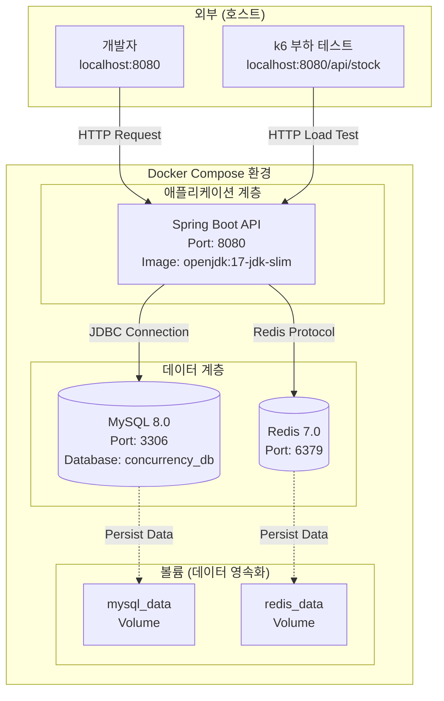
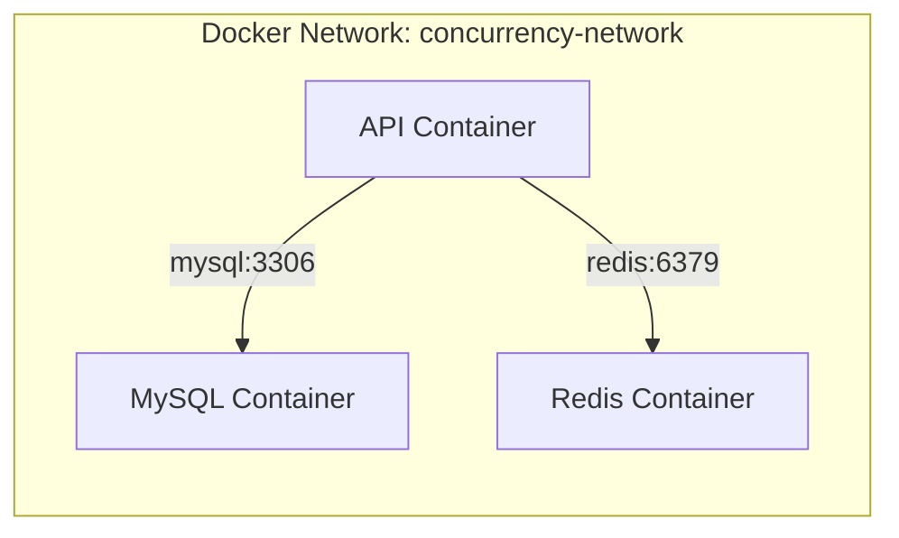
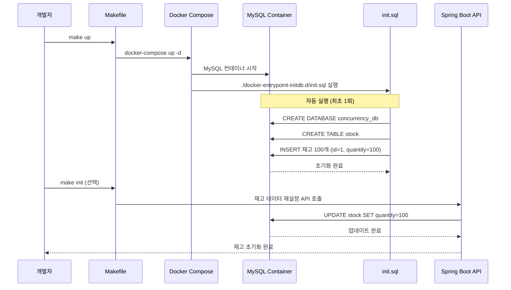
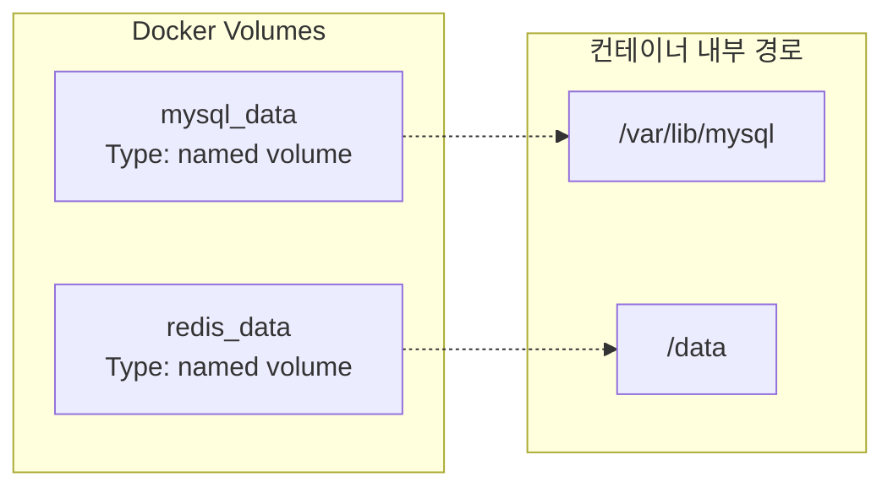
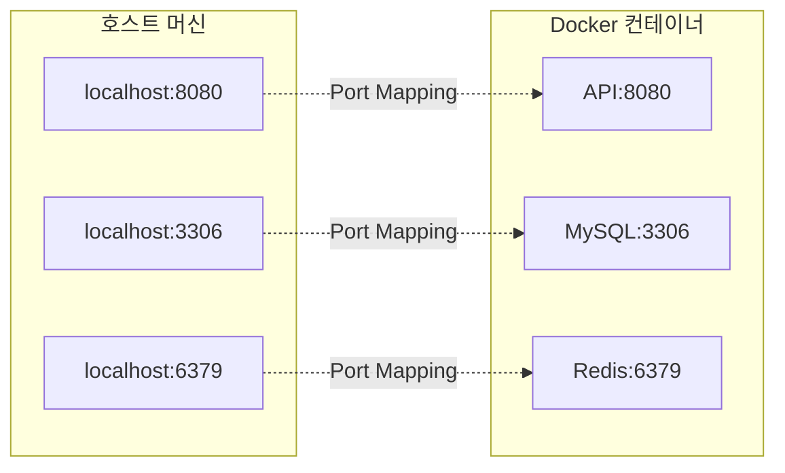
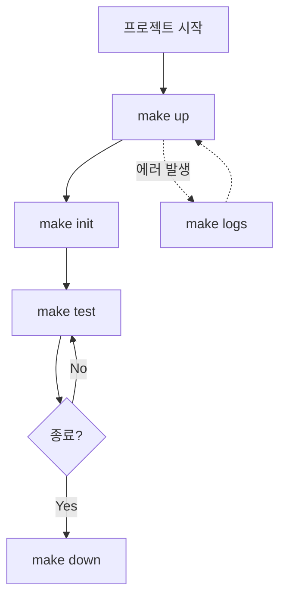

# 인프라 아키텍처

## 개요

이 문서는 Concurrency Control PoC 프로젝트의 인프라 환경을 설명합니다.

---

## 1. Docker Compose 환경 구성

### 전체 구성도



### 컨테이너 상세

| 컨테이너 | 이미지 | 포트 | 용도 |
|---------|--------|------|------|
| **mysql** | mysql:8.0 | 3306 | 재고 데이터 영속화 (Stock 테이블) |
| **redis** | redis:7.0-alpine | 6379 | 분산 락 + Lua Script 실행 |
| **api** | openjdk:17-jdk-slim | 8080 | Spring Boot API (개발 중에는 로컬 실행) |

### 네트워크 설정



- **네트워크 이름:** `concurrency-network`
- **네트워크 드라이버:** bridge
- **컨테이너 간 통신:** 서비스 이름으로 통신 (mysql, redis)

---

## 2. 데이터 초기화 플로우

### 초기화 프로세스



### 초기 데이터 스키마

**Stock 테이블:**

```sql
CREATE TABLE stock (
    id BIGINT PRIMARY KEY AUTO_INCREMENT,
    product_id VARCHAR(100) NOT NULL,
    quantity INT NOT NULL,
    version BIGINT DEFAULT 0,  -- Optimistic Lock용
    created_at TIMESTAMP DEFAULT CURRENT_TIMESTAMP,
    updated_at TIMESTAMP DEFAULT CURRENT_TIMESTAMP ON UPDATE CURRENT_TIMESTAMP
);

-- 초기 데이터 (재고 100개)
INSERT INTO stock (product_id, quantity) VALUES ('PRODUCT-001', 100);
```

**초기 상태:**
- 상품 ID: `PRODUCT-001`
- 초기 재고: `100`개
- Version: `0` (Optimistic Lock 용)

---

## 3. 볼륨 구조

### 데이터 영속화



**볼륨 설정:**
- `mysql_data`: MySQL 데이터 디렉터리 (`/var/lib/mysql`)
- `redis_data`: Redis 데이터 디렉터리 (`/data`)

**영속화 목적:**
- 컨테이너 재시작 시 데이터 보존
- 테스트 결과 재현성 확보
- 부하 테스트 중 데이터 손실 방지

---

## 4. 헬스체크 설정

### MySQL 헬스체크

```yaml
healthcheck:
  test: ["CMD", "mysqladmin", "ping", "-h", "localhost"]
  interval: 10s
  timeout: 5s
  retries: 5
  start_period: 30s
```

**동작:**
- 10초마다 MySQL 연결 확인
- 30초 대기 후 헬스체크 시작
- 5회 실패 시 unhealthy 상태

### Redis 헬스체크

```yaml
healthcheck:
  test: ["CMD", "redis-cli", "ping"]
  interval: 10s
  timeout: 5s
  retries: 5
  start_period: 10s
```

**동작:**
- 10초마다 Redis PING 확인
- 10초 대기 후 헬스체크 시작
- 5회 실패 시 unhealthy 상태

---

## 5. 포트 매핑



**포트 매핑:**
- `8080:8080` - Spring Boot API
- `3306:3306` - MySQL
- `6379:6379` - Redis

**접근 방법:**
- API: `http://localhost:8080`
- MySQL: `mysql -h localhost -P 3306 -u root -p`
- Redis: `redis-cli -h localhost -p 6379`

---

## 6. 환경 변수

### MySQL 환경 변수

```bash
MYSQL_ROOT_PASSWORD=root1234
MYSQL_DATABASE=concurrency_db
MYSQL_USER=app_user
MYSQL_PASSWORD=app_password
```

### Spring Boot 환경 변수

```bash
SPRING_DATASOURCE_URL=jdbc:mysql://mysql:3306/concurrency_db
SPRING_DATASOURCE_USERNAME=app_user
SPRING_DATASOURCE_PASSWORD=app_password
SPRING_REDIS_HOST=redis
SPRING_REDIS_PORT=6379
```

---

## 7. Makefile 명령어

### 주요 명령어



**명령어 설명:**

| 명령어 | 동작 | 설명 |
|--------|------|------|
| `make up` | docker-compose up -d | 모든 컨테이너 시작 (백그라운드) |
| `make down` | docker-compose down | 모든 컨테이너 중지 및 제거 |
| `make init` | 데이터 초기화 API 호출 | 재고를 100개로 재설정 |
| `make logs` | docker-compose logs -f | 전체 로그 실시간 확인 |
| `make ps` | docker-compose ps | 컨테이너 상태 확인 |
| `make clean` | docker-compose down -v | 컨테이너 + 볼륨 모두 제거 |
| `make restart` | down + up | 전체 재시작 |
| `make mysql` | mysql 접속 | MySQL CLI 접속 |
| `make redis` | redis-cli 접속 | Redis CLI 접속 |

---

## 8. 로컬 개발 환경 검증

### 검증 체크리스트

```bash
# 1. Docker Compose 실행
make up

# 2. 컨테이너 상태 확인 (모두 healthy 상태여야 함)
make ps

# 3. MySQL 접속 확인
make mysql
> SELECT * FROM stock;

# 4. Redis 접속 확인
make redis
> PING
> SET test "hello"
> GET test

# 5. API 헬스체크 (Spring Boot 실행 후)
curl http://localhost:8080/actuator/health

# 6. 재고 조회 API 테스트
curl http://localhost:8080/api/stock/1
```

**성공 기준:**
- ✅ 모든 컨테이너가 `healthy` 상태
- ✅ MySQL에서 `stock` 테이블 조회 가능
- ✅ Redis PING 응답 `PONG`
- ✅ API 헬스체크 응답 `{"status":"UP"}`
- ✅ 재고 조회 시 `{"id":1, "quantity":100}` 반환

---

## 9. 트러블슈팅

### 자주 발생하는 문제

**문제 1: 포트 충돌**
```bash
# 에러: Bind for 0.0.0.0:3306 failed: port is already allocated
# 해결: 기존 MySQL/Redis 프로세스 종료
lsof -i :3306
kill -9 <PID>
```

**문제 2: 헬스체크 실패**
```bash
# 컨테이너 로그 확인
make logs

# MySQL 로그 확인
docker-compose logs mysql

# Redis 로그 확인
docker-compose logs redis
```

**문제 3: 데이터 초기화 실패**
```bash
# 볼륨까지 모두 제거 후 재시작
make clean
make up
```

---

## 관련 문서

- [ADR-004: 왜 MySQL과 Redis를 선택했는가?](../adr/ADR-004-why-mysql-and-redis.md)
- [애플리케이션 아키텍처](./application.md)
- [시스템 전체 구성](./system-overview.md)
