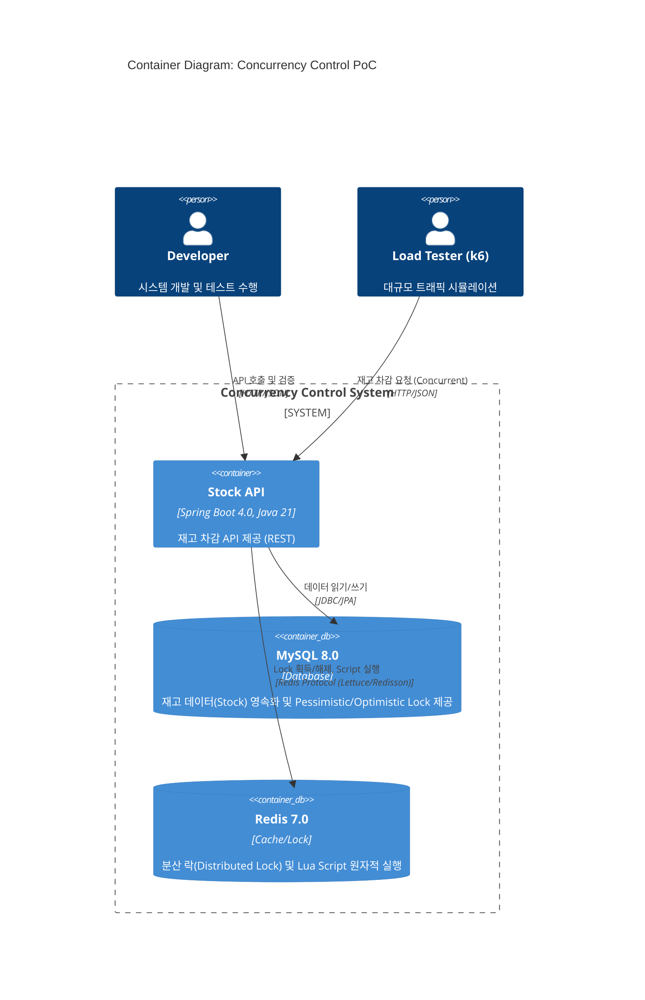
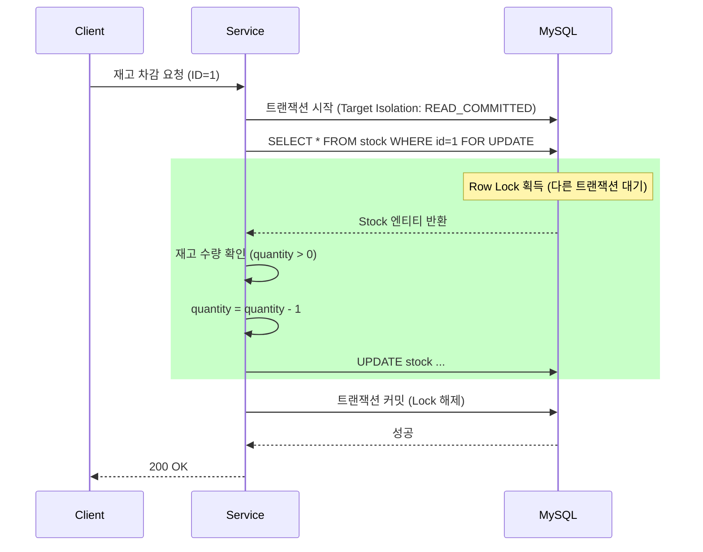
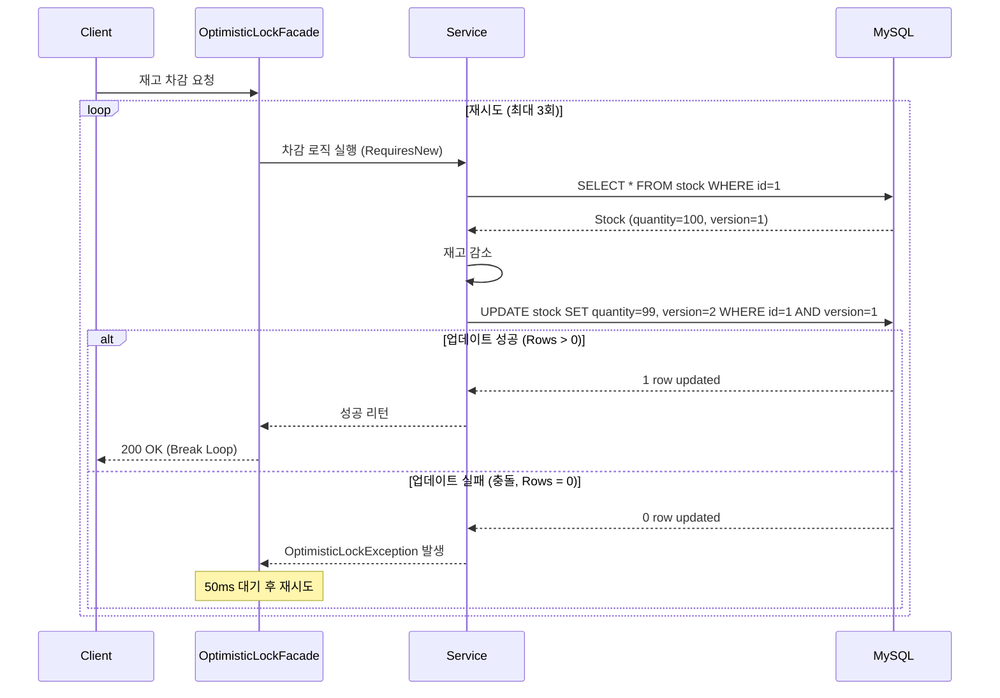
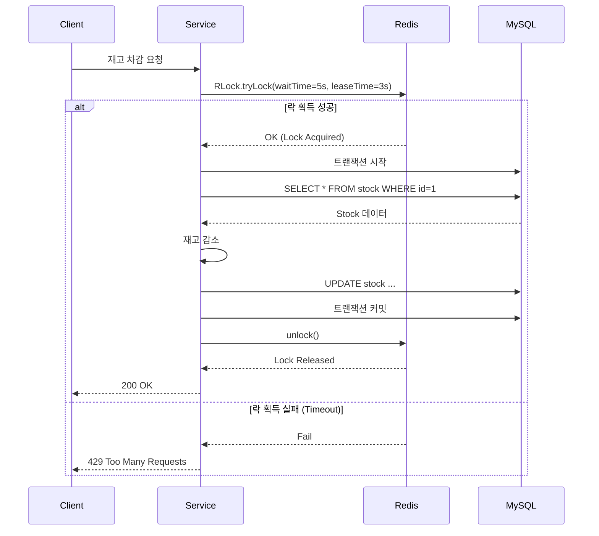
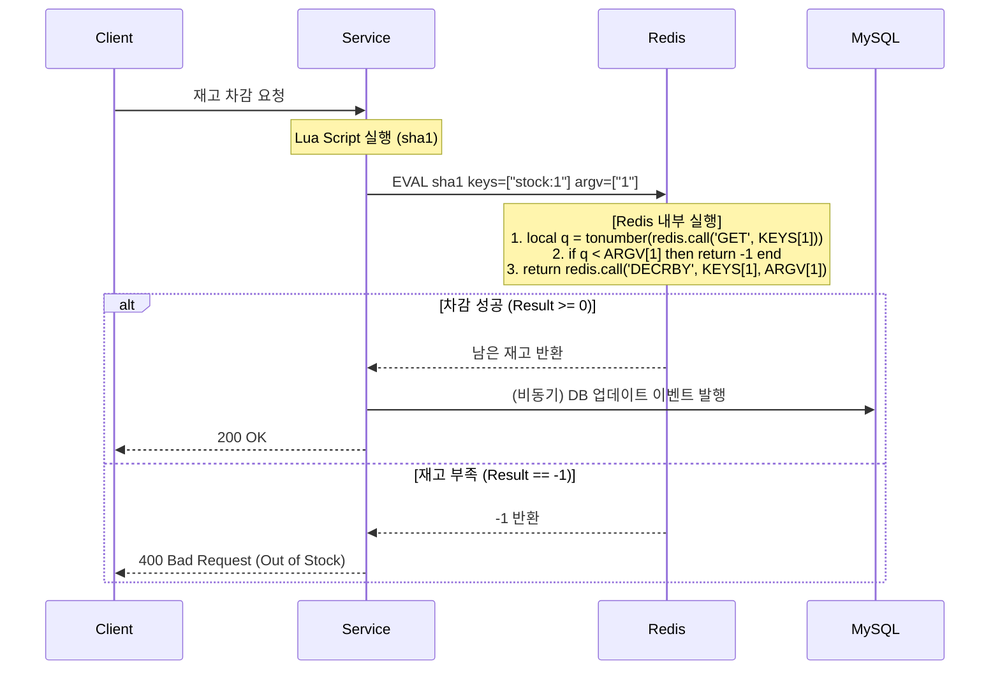
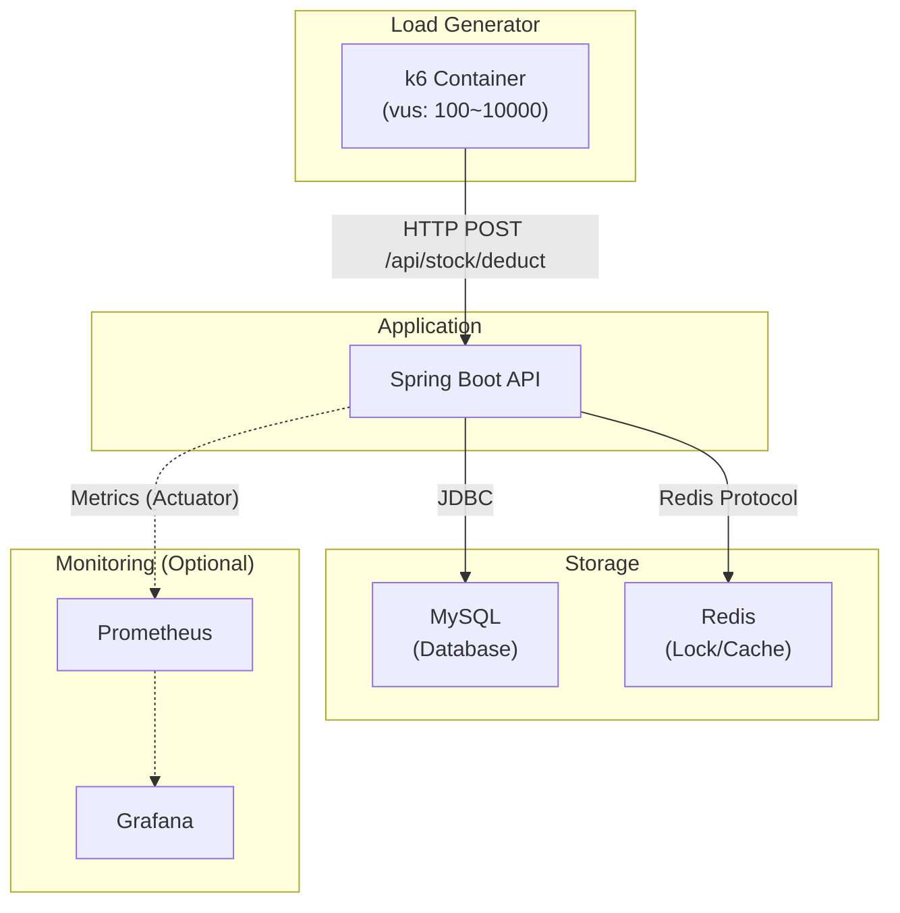

# 시스템 전체 구성 (System Overview)

## 1. C4 Container Diagram

전체 시스템은 단일 **Spring Boot 애플리케이션**을 중심으로 데이터 정합성을 위한 **MySQL(Lock)**과 성능 최적화를 위한 **Redis(Distributed Lock/Lua Script)**로 구성됩니다.

---

## 2. 동시성 제어 시퀀스 다이어그램 (Concurrency Control Flows)

### 2.1. Pessimistic Lock (비관적 락)
**핵심 구현:** JPA의 `@Lock(LockModeType.PESSIMISTIC_WRITE)`를 사용하여 `SELECT ... FOR UPDATE` 쿼리를 실행합니다.

### 2.2. Optimistic Lock (낙관적 락)
**핵심 구현:** JPA의 `@Version` 어노테이션을 사용하여 `UPDATE ... WHERE version = ?` 쿼리를 실행하고, 실패 시 애플리케이션 레벨에서 재시도(Retry)합니다.

### 2.3. Redis Distributed Lock (분산 락)
**핵심 구현:** Redisson 라이브러리의 `RLock`을 사용하여 Pub/Sub 기반의 효율적인 락을 구현합니다.

### 2.4. Redis Lua Script (원자적 연산)
**핵심 구현:** Redis의 단일 스레드 특성과 Lua Script의 원자성을 활용하여, Lock 획득 과정 없이 재고를 차감합니다.

---

## 3. 부하 테스트 아키텍처

k6를 사용하여 동시 사용자(VU)를 시뮬레이션하고, 각 구현체의 **TPS(처리량)**와 **Latency(지연 시간)**를 측정합니다.

### 테스트 시나리오
1.  **Warm-up:** VUs 10 -> 100 (30초) - JVM 워밍업
2.  **Load:** VUs 1000 (1분) - TPS 및 Latency 측정 (안정 구간)
3.  **Stress:** VUs 5000+ (1분) - 한계 지점(Fail Point) 확인 및 병목 지점 파악
4.  **Cool-down:** VUs 0 (30초) - 리소스 회수 확인
