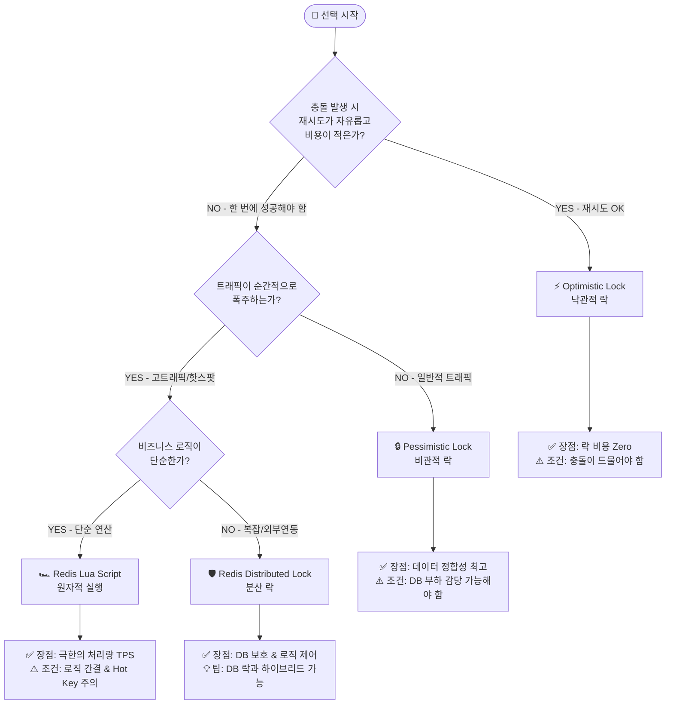

# [Practical Guide] 동시성 제어 실무 의사결정 가이드

**작성일:** 2026-02-05
**목적:** 복잡한 기술 이론 대신, 비즈니스 상황에 맞춰 최적의 동시성 제어 방식을 **5분 안에 선택**할 수 있도록 돕는 실무 지침서.

---

## 1. Decision Tree: 무엇을 선택해야 할까?

비즈니스 요구사항에 따라 "Yes/No"를 선택하며 최적의 도구를 찾아보세요.

---

## 2. Comparison Matrix: 한눈에 비교하기

| 특성 | **Pessimistic Lock** | **Optimistic Lock** | **Redis Dist. Lock** | **Redis Lua Script** |
| :--- | :--- | :--- | :--- | :--- |
| **별명** | **"철통 방어"** | **"일단 고(Go)"** | **"문지기(Throttling)"** | **"초고속 엔진"** |
| **주체** | DB (Row Lock) | Application (Version) | Redis (Key) | Redis (Single Thread) |
| **성능 (TPS)** | ⭐⭐ (낮음) | ⭐⭐⭐ (보통/상황탐) | ⭐⭐⭐ (보통) | ⭐⭐⭐⭐⭐ **(압도적)** |
| **정합성** | ⭐⭐⭐⭐⭐ **(최고)** | ⭐⭐⭐⭐ (재시도 필수) | ⭐⭐⭐ (유실 가능성) | ⭐⭐⭐⭐ (스크립트 의존) |
| **구현 난이도** | 쉬움 (`@Lock`) | 보통 (Retry 로직) | 보통 (Redisson) | 어려움 (Lua 코드) |
| **주요 비용** | DB 커넥션/CPU | 재시도 시 CPU | 네트워크 RTT | Redis CPU |
| **추천 상황** | **결제, 계좌 이체** | **어드민, 위키, 정보수정** | **선착순 진입 제어** | **초대형 선착순, 좋아요** |

---

## 3. Best Practice Scenarios: 상황별 상세 전략

현실 세계의 문제는 단순하지 않습니다. 같은 도메인이라도 **트래픽 규모, 아키텍처, 비즈니스 복잡도**에 따라 정답이 달라집니다.

### 💰 Scenario A: "돈이 오가는 결제 시스템"
결제는 정합성이 생명이지만, 아키텍처에 따라 선택이 갈립니다.

*   **Case 1: 모놀리식 & 일반 트래픽 (Startups/SMB)**
    *   **추천:** **Pessimistic Lock**
    *   **이유:** 단일 DB 환경에서는 DB 락만큼 확실하고 구현이 쉬운 것이 없습니다. 인프라 복잡도를 높이지 말고 DB의 ACID 기능을 100% 활용하세요.
*   **Case 2: MSA & 대규모 트래픽 (Tech Giants/Fintech)**
    *   **추천:** **Redis Distributed Lock** (with DB Unique Key)
    *   **이유:** 서비스가 분산되어 DB 락을 걸 수 없거나, 트래픽이 많아 DB가 병목이 되는 경우입니다. Redis로 분산 환경의 동시성을 제어하고, DB는 Unique Key로 최종 방어선 역할만 수행합니다. (예: 토스 사례)

### 🎫 Scenario B: "티켓팅 & 선착순 이벤트"
"선착순"이라고 다 같은 게 아닙니다. 로직의 복잡도가 핵심입니다.

*   **Case 1: 단순 선착순 (배민 쿠폰)**
    *   **추천:** **Redis Lua Script**
    *   **이유:** "유저 A가 쿠폰 B를 받았다" 정도의 단순 로직이라면, 락을 걸고 푸는 비용조차 아깝습니다. Lua Script(`SADD`)로 원자적 처리를 하는 것이 가장 빠릅니다.
*   **Case 2: 복합 티켓팅 (인터파크 좌석 예매)**
    *   **추천:** **Redis Distributed Lock + DB Pessimistic Lock (Hybrid)**
    *   **이유:** **계층적 방어(Layered Defense)**가 필요합니다.
        *   **1차(Redis):** 대규모 트래픽을 제어(Throttling)하여 DB 부하를 막습니다.
        *   **2차(DB):** Redis를 통과한 요청에 대해 비관적 락으로 **최종 정합성**을 보장하고 중복 예매를 원천 차단합니다.
        *   복잡한 로직은 애플리케이션 레벨(Redis 락 안쪽)에서 처리하고, 데이터 무결성은 DB에 맡기는 전략입니다.

### 🛒 Scenario C: "한정판 상품 판매 (E-commerce)"
재고 관리의 디테일에 따라 선택이 달라집니다.

*   **Case 1: 재고 수량만 중요함 (플래시 세일)**
    *   **추천:** **Redis Lua Script (`DECRBY`)**
    *   **이유:** 단순히 숫자만 깎는 거라면 Lua가 압도적입니다.
*   **Case 2: 유저별 구매 제한 + 블랙리스트 체크**
    *   **추천:** **Redis Distributed Lock (Redisson)**
    *   **이유:** "이 유저가 어제도 샀나?", "블랙리스트인가?" 등 외부 API나 DB 조회가 필요한 경우, 락을 걸고 애플리케이션에서 천천히 검증해야 합니다. Lua 안에서는 외부 호출이 불가능합니다.

### 📝 Scenario D: "정보 수정 & 협업"
충돌의 빈도와 해결 방식에 따라 나뉩니다.

*   **Case 1: 단순 정보 수정 (내 프로필, 어드민)**
    *   **추천:** **Optimistic Lock**
    *   **이유:** 충돌이 거의 안 납니다. 락 없이 쾌적하게 조회하고, 저장할 때만 버전(`version`)을 체크하면 됩니다.
*   **Case 2: 실시간 동시 편집 (Google Docs, Notion)**
    *   **추천:** **Operational Transformation (OT) / CRDT** (Not Locking)
    *   **이유:** 이건 "락"으로 해결할 문제가 아닙니다. A와 B가 동시에 타이핑하는데 락을 걸면 서로 멈춥니다. 락 대신 "변경 사항을 병합(Merge)"하는 알고리즘이 필요합니다. (락의 영역을 넘어섬)

---

## 4. Final Verdict: "적재적소(Right Tool for Right Job)"

동시성 제어 기술은 절대적인 우열이 없습니다. 오직 **비즈니스 요구사항과 아키텍처 환경**에 따른 최선의 선택이 있을 뿐입니다.

*   **Pessimistic:** 어떠한 극한 환경에서도 데이터 무결성을 보장하는 **Strong Consistency Anchor (최후의 보루)**.
*   **Optimistic:** 평소에는 개입하지 않다가 정합성 이슈만 예민하게 반응하는 **Conflict Detection Sensor (충돌 감지기)**.
*   **Redis Lock:** 다중 서버(Multi-Server) 및 분산 환경에서 DB로 향하는 무분별한 부하를 사전에 제어하는 **Distributed Traffic Gatekeeper (트래픽 관문)**.
*   **Lua Script:** 락의 오버헤드를 연산의 원자성으로 승화시켜 물리적 한계에 도전하는 **Atomic Execution Engine (원자적 연산 엔진)**.

> **"여러분의 아키텍처는 지금 무엇을 지키고자 합니까?"**
> 데이터의 정합성(Trust)과 시스템의 처리량(Throughput) 사이에서 최적의 균형점(Pivot)을 찾는 것이 시니어 엔지니어의 핵심 역량입니다.
