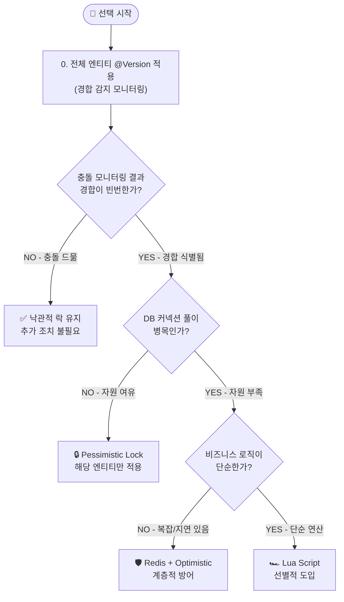

# [Practical Guide] 동시성 제어 실무 의사결정 가이드

**작성일:** 2026-02-05
**목적:** `concurrency-control-poc` Sprint 5-7 검증 결과를 기반으로, 비즈니스 상황에 맞춰 최적의 동시성 제어 방식을 선택하고 도입하기 위한 실무 지침서.

---

## 1. 전략적 패러다임: 점진적 최적화 (Progressive Optimization)

동시성 제어는 본질적으로 **쓰기 최적화(Write Optimization)**의 문제입니다. 같은 데이터에 동시에 쓰려는 요청들을 어떻게 안전하고 효율적으로 처리할 것인가 — 이것이 핵심 과제입니다.

"어떤 기술이 가장 빠른가?"의 문제가 아니라 **"어디서 경합이 발생하는지 어떻게 감지하고, 단계적으로 대응하는가?"**의 문제입니다.

### 0단계: 낙관적 락 — 전체 엔티티의 기본 보험
- **철학:** "모든 도메인에 혹시 모를 경합 상황이 일어날 수 있음을 인정하고, 보험처럼 들어놓는다."
- **적용:** 모든 엔티티에 `@Version`을 기본 적용. 평상시 오버헤드는 거의 없음(버전 컬럼 비교 1회).
- **가치:** 충돌 발생 시 `ObjectOptimisticLockingFailureException`이 발생하며, 이를 모니터링하면 경합이 빈번한 엔티티를 자연스럽게 식별할 수 있음.
- **실험 결과:** 저경합 환경에서 낙관적 락(89.36 TPS)이 비관적 락(86.95 TPS)보다 겨우 2.8% 높았을 뿐이며, 재시도를 포함하면 오히려 역전(83.50 vs 86.95 TPS). 성능이 아닌 **경합 감지**가 존재 이유.

### 1단계: 비관적 락 — 경합 지점의 타겟 솔루션
- **철학:** "낙관적 락이 보내는 충돌 신호에 반응하여, 식별된 엔티티에만 선택적으로 적용한다."
- **구조:** 별도의 인프라 없이 DB Row Lock(`SELECT ... FOR UPDATE`)만으로 정합성을 보장.
- **적합성:** 대부분의 비즈니스 환경. 복잡한 ACID 트랜잭션, 데이터 정확도가 최우선인 시스템.
- **실험 결과:** 고경합 복합 트랜잭션에서 **100% 데이터 정합성, 자원 낭비 제로**. 실질 처리량 1위.

### 2단계: Redis + 낙관적 락 — 스케일 전략
- **철학:** "비관적 락의 응답 시간이 비즈니스 허용 임계치를 넘어설 때, Redis를 전방에 배치한다."
- **구조:** Redis가 전방에서 유입량을 조절(Fail-fast)하고, 낙관적 락(`@Version`)이 최종 정합성을 검증.
- **적합성:** DB 커넥션 풀이 실질적 병목이 되는 고부하 환경.
- **실험 결과:** 500 VUs 환경에서 비관적 락(p95 13.48s) 대비 Redis+Optimistic(p95 3.29s)이 안정적 응답 시간 유지.
- **주의:** 비관적 락이 충분히 동작하는 환경에서 섣불리 도입하지 마라. Redis의 **관리 비용은 숨겨진 대가**다.

---

## 2. Decision Tree: 무엇을 선택해야 할까?

---

## 3. 의사결정 매트릭스 (Decision Matrix)

| 상황 (Scenario) | 추천 방식 (Best Practice) | 이유 (Why) |
| :--- | :--- | :--- |
| **모든 엔티티 (기본)** | **Optimistic Lock (`@Version`)** | • **경합 감지 모니터링:** 충돌 모니터링으로 비관적 락 적용 지점 식별 • **오버헤드 거의 없음:** 버전 컬럼 비교 1회 |
| **경합이 식별된 엔티티**   (일반적 트래픽) | **Pessimistic Lock** | • **안정성:** 100% 성공률, 자원 낭비 제로 • **구현 용이:** `@Lock` 어노테이션으로 간단 구현 • **가성비:** 별도 Redis 운영 비용 없음 |
| **DB 커넥션 풀 병목**   (고부하, 긴 트랜잭션) | **Redis + Optimistic Lock** | • **계층적 방어:** Redis Fail-fast + DB 최종 검증 • **생존력:** DB 커넥션 고갈 방지 • **전제:** 클라이언트 스마트 재시도 협업 필요 |
| **극한 Hotspot**   (단순 로직, 초고부하) | **Redis Lua Script** | • **독보적 성능:** 3,491 TPS (타 방식 대비 3.5배) • **전제:** 비즈니스 로직 간소화 + DB 동기화 전략 필수 • **선별적 도입:** 특정 상품에만 적용 |

---

## 4. Comparison Matrix: 한눈에 비교하기

| 특성 | **Pessimistic Lock** | **Optimistic Lock** | **Redis Dist. Lock** | **Redis Lua Script** |
| :--- | :--- | :--- | :--- | :--- |
| **별명** | **"철통 방어"** | **"일단 고(Go)"** | **"문지기(Throttling)"** | **"초고속 엔진"** |
| **주체** | DB (Row Lock) | Application (Version) | Redis (Key) | Redis (Single Thread) |
| **성능 (TPS)** | ⭐⭐ (낮음) | ⭐⭐⭐ (보통/상황탐) | ⭐⭐⭐ (보통) | ⭐⭐⭐⭐⭐ **(압도적)** |
| **정합성** | ⭐⭐⭐⭐⭐ **(최고)** | ⭐⭐⭐⭐ (재시도 필수) | ⭐⭐⭐ (유실 가능성) | ⭐⭐⭐⭐ (스크립트 의존) |
| **구현 난이도** | 쉬움 (`@Lock`) | 보통 (Retry 로직) | 보통 (Redisson) | 어려움 (Lua 코드) |
| **주요 비용** | DB 커넥션/CPU | 재시도 시 CPU | 네트워크 RTT | Redis CPU |
| **추천 상황** | **결제, 계좌 이체** | **어드민, 위키, 정보수정** | **선착순 진입 제어** | **초대형 선착순, 좋아요** |

---

## 5. Best Practice Scenarios: 상황별 상세 전략

현실 세계의 문제는 단순하지 않습니다. 같은 도메인이라도 **트래픽 규모, 아키텍처, 비즈니스 복잡도**에 따라 정답이 달라집니다.

### 💰 Scenario A: "돈이 오가는 결제 시스템"
결제는 정합성이 생명이지만, 아키텍처에 따라 선택이 갈립니다.

*   **Case 1: 모놀리식 & 일반 트래픽 (Startups/SMB)**
    *   **추천:** **Pessimistic Lock**
    *   **이유:** 단일 DB 환경에서는 DB 락만큼 확실하고 구현이 쉬운 것이 없습니다. 인프라 복잡도를 높이지 말고 DB의 ACID 기능을 100% 활용하세요.
*   **Case 2: MSA & 대규모 트래픽 (Tech Giants/Fintech)**
    *   **추천:** **Redis Distributed Lock** (with DB Unique Key)
    *   **이유:** 서비스가 분산되어 DB 락을 걸 수 없거나, 트래픽이 많아 DB가 병목이 되는 경우입니다. Redis로 분산 환경의 동시성을 제어하고, DB는 Unique Key로 최종 방어선 역할만 수행합니다. (예: 토스 사례)

### 🎫 Scenario B: "티켓팅 & 선착순 이벤트"
"선착순"이라고 다 같은 게 아닙니다. 로직의 복잡도가 핵심입니다.

*   **Case 1: 단순 선착순 (배민 쿠폰)**
    *   **추천:** **Redis Lua Script**
    *   **이유:** "유저 A가 쿠폰 B를 받았다" 정도의 단순 로직이라면, 락을 걸고 푸는 비용조차 아깝습니다. Lua Script(`SADD`)로 원자적 처리를 하는 것이 가장 빠릅니다.
*   **Case 2: 복합 티켓팅 (인터파크 좌석 예매)**
    *   **추천:** **Redis Distributed Lock + Optimistic Lock (Hybrid)**
    *   **이유:** **계층적 방어(Layered Defense)**가 필요합니다.
        *   **1차(Redis):** 요청을 직렬화하여 한 번에 하나의 요청만 임계 구역에 진입시킵니다. 나머지 요청은 Redis에서 대기하므로, DB에 도달하는 시점에는 **애플리케이션 레벨의 동시 쓰기 경합 자체가 없는 상태**입니다.
        *   **2차(DB):** 낙관적 락(`@Version`)을 최후 안전망으로 둡니다. 정상 흐름에서는 Redis가 직렬화를 보장하므로 거의 작동하지 않지만, Redis 장애나 예외적 상황에서 DB 레벨의 정합성을 최종 보장합니다.

### 🛒 Scenario C: "한정판 상품 판매 (E-commerce)"
재고 관리의 디테일에 따라 선택이 달라집니다.

*   **Case 1: 재고 수량만 중요함 (플래시 세일)**
    *   **추천:** **Redis Lua Script (`DECRBY`)**
    *   **이유:** 단순히 숫자만 깎는 거라면 Lua가 압도적입니다.
*   **Case 2: 유저별 구매 제한 + 블랙리스트 체크**
    *   **추천:** **Redis Distributed Lock (Redisson)**
    *   **이유:** "이 유저가 어제도 샀나?", "블랙리스트인가?" 등 외부 API나 DB 조회가 필요한 경우, 락을 걸고 애플리케이션에서 천천히 검증해야 합니다. Lua 안에서는 외부 호출이 불가능합니다.

### 📝 Scenario D: "정보 수정 & 협업"
충돌의 빈도와 해결 방식에 따라 나뉩니다.

*   **Case 1: 단순 정보 수정 (내 프로필, 어드민)**
    *   **추천:** **Optimistic Lock**
    *   **이유:** 충돌이 거의 안 납니다. 락 없이 쾌적하게 조회하고, 저장할 때만 버전(`version`)을 체크하면 됩니다.
*   **Case 2: 실시간 동시 편집 (Google Docs, Notion)**
    *   **추천:** **Operational Transformation (OT) / CRDT** (Not Locking)
    *   **이유:** 이건 "락"으로 해결할 문제가 아닙니다. A와 B가 동시에 타이핑하는데 락을 걸면 서로 멈춥니다. 락 대신 "변경 사항을 병합(Merge)"하는 알고리즘이 필요합니다. (락의 영역을 넘어섬)

---

## 6. 방식별 구현 및 운영 가이드

### ① Optimistic Lock — 경합 감지 모니터링 (0단계 기본값)
*   **적용 대상:** 모든 도메인 엔티티. 성능을 위한 것이 아니라 **경합 감지를 위한 보험**.
*   **핵심 가치:** `@Version` 하나로 데이터가 조용히 덮어써지는 것을 방지하고, 충돌 발생 시 `ObjectOptimisticLockingFailureException`으로 경합 지점을 알려줌.
*   **실험 결과:** 저경합 환경에서 비관적 락 대비 TPS 차이 2.8%에 불과. 재시도 포함 시 오히려 역전(83.50 vs 86.95 TPS).
*   **운영 Tip:**
    *   **충돌 모니터링:** `OptimisticLockException` 발생 빈도를 로그 집계하고 알림을 설정하세요. 이것이 비관적 락을 적용할 엔티티를 식별하는 가장 자연스러운 방법입니다.
    *   **커넥션 효율:** 락 점유 시간이 '0'이므로 같은 트래픽 대비 DB 커넥션을 아껴 씁니다. 트래픽이 증가할수록 이 이점이 커집니다.
    *   **재시도 전략:** 충돌 발생 시 Exponential Backoff + Jitter 정책을 마련하세요. 단, 재시도가 빈번해지면 비관적 락 전환을 고려하세요.

### ② Pessimistic Lock — 경합 지점의 타겟 솔루션 (1단계)
*   **적용 대상:** 낙관적 락 모니터링에서 경합이 식별된 엔티티. 금융 거래, 물류 재고 등 데이터 정확도가 생명인 시스템.
*   **핵심 가치:** 100% 성공률, 자원 낭비 제로. 모든 DB 커넥션이 비즈니스 가치를 생산함.
*   **실험 결과:** 복합 트랜잭션에서 실질 처리량 1위. 저경합 환경에서도 성능/안정성/구현 단순성 종합 1위.
*   **⚠️ Easy to Use, Hard to Master:**
    JPA의 `@Lock(PESSIMISTIC_WRITE)`은 사용이 간편하지만, 그 아래에서 동작하는 락은 **RDBMS 제품마다 특성이 다릅니다.**
    *   **MySQL (InnoDB):** Row Lock 외에 **Gap Lock, Next-Key Lock**이 존재하여 범위 조회 시 의도하지 않은 넓은 범위가 잠길 수 있음.
    *   **PostgreSQL:** Row Lock이 비교적 단순하지만, **Advisory Lock** 등 고유 기능이 있으며, MVCC 구현 방식이 달라 동일 쿼리라도 락 범위가 다를 수 있음.
    *   **핵심:** JPA가 SQL을 생성해주더라도, **실행 계획(EXPLAIN)을 통해 락이 걸리는 실제 범위를 반드시 확인**하세요.
*   **운영 Tip:**
    *   **타임아웃 설정:** 무한 대기를 막기 위해 `javax.persistence.lock.timeout` 힌트를 반드시 설정하세요.
    *   **인덱스 필수:** 락을 거는 컬럼에 인덱스가 없으면 **테이블 풀 스캔 + 테이블 락**이 걸려 재앙이 발생합니다.
    *   **트랜잭션 최소화:** 트랜잭션 내에서 시간이 오래 걸리는 작업(외부 API 호출 등)은 트랜잭션 외부로 빼내어 커넥션 점유 시간을 줄이세요.
*   **⚠️ 팀/시스템 규모가 커지면 재검토가 필요합니다:**
    비관락에서 데드락을 방지하려면 락 획득 순서를 일관되게 유지해야 합니다. 예를 들어 `stock → item` 순서로 락을 잡는 트랜잭션과 `item → stock` 순서로 잡는 트랜잭션이 공존하면 데드락이 발생합니다. 문제는 이 순서 규칙이 **코드가 아닌 팀 컨벤션에만 존재**한다는 것입니다.
    *   신규 입사자가 컨벤션을 모를 수 있음 — 위반은 런타임에서만 드러나고 코드 리뷰로 잡기 어려움
    *   팀과 코드베이스가 커질수록 컨벤션 유지 비용 증가
    *   MSA 환경에서는 서비스 간 락 순서 협의 자체가 불가능
    *   **이것이 MSA나 복잡한 도메인 환경에서 Redis + 낙관락이 비관락보다 선호되는 이유입니다.** 낙관락은 데드락이 원천적으로 없고, 충돌 시 `ObjectOptimisticLockingFailureException`이라는 명시적 예외로 처리 방식이 코드에 드러납니다.

### ③ Redis + Optimistic Lock — 계층적 방어 (2단계)
*   **적용 대상:** 비관적 락의 응답 시간이 비즈니스 허용 임계치를 넘어서는 고부하 환경. DB 커넥션 풀이 실질적 병목인 상황.
*   **핵심 가치:** Redis가 전방에서 Fail-fast로 유입량을 조절하고, 낙관적 락(`@Version`)이 최종 정합성을 검증하는 계층적 방어.
*   **실험 결과:** 500 VUs 환경에서 비관적 락(p95 13.48s) 대비 Redis+Optimistic(p95 3.29s)이 안정적 응답 시간 유지.
*   **운영 Tip:**
    *   **도입 시점:** 비관적 락이 충분히 동작하는 환경에서 섣불리 도입하지 마세요. 자원이 널널한 환경에서 Redis 도입은 네트워크 홉만 추가하여 오히려 성능 저하.
    *   **Fallback 계획:** Redis 장애 시 DB 락으로 전환(Fallback)할 수 있는 구조를 마련하세요.
    *   **클라이언트 협업:** Fail-fast 응답을 받은 클라이언트가 Exponential Backoff + Jitter로 재시도하는 스마트 재시도 전략이 필수입니다.

### ④ Redis Lua Script — 극한 성능의 선별적 무기
*   **적용 대상:** 티켓팅, 쿠폰 발급, 타임 세일 등 트래픽이 폭주하는 **특정 상품에만 선별적 적용**.
*   **핵심 가치:** `EVAL` 명령어를 통해 스크립트 자체가 하나의 원자적(Atomic) 연산으로 실행. 독보적 3,491 TPS.
*   **실험 결과:** 비즈니스 로직을 간소화하면 비관적 락도 26.7배 향상(36→978 TPS). Lua Script 도입의 정당성은 **TPS가 아니라 DB 커넥션 자원 보호**에 있음.
*   **운영 Tip:**
    *   **스크립트 관리:** Lua 스크립트는 형상 관리(Git)에 포함하고, 해시값(SHA)으로 호출(`EVALSHA`)하여 네트워크 대역폭을 아끼세요.
    *   **복잡도 제한:** Redis는 싱글 스레드입니다. 스크립트 실행 시간이 길어지면 전체 Redis가 멈춥니다. 단순 연산만 포함하세요.
    *   **DB 동기화:** Redis에서 차감한 재고를 DB에 동기화하는 전략(Event-Driven, Batch 등)이 반드시 필요합니다.

---

## 7. 인프라 사이징 가이드 (Sizing Guide)

### 가장 먼저: 커넥션 풀 설정을 파악하라

인프라를 증설하기 전에, **현재 인프라에서 최대한 활용할 수 있는 DB 커넥션 풀 수를 아는 것**이 가장 중요합니다. `application.yml`의 HikariCP `maximum-pool-size` 하나가 동시성 제어의 성능 천장을 결정합니다.

본 프로젝트에서도 DB Pool을 10으로 제한했을 때와 50으로 설정했을 때 동일 인프라에서 완전히 다른 결과가 나왔습니다. **서버를 늘리기 전에 커넥션 풀 튜닝이 먼저입니다.**

### 트래픽 규모별 권장 스펙

| 예상 트래픽 (RPS) | 권장 스펙 (App/DB) | 추천 아키텍처 | 비고 |
| :---: | :--- | :--- | :--- |
| **~ 100 RPS** | 2 vCPU / 4GB RAM | **Pessimistic Lock** | 단일 DB로 충분. @Version 모니터링으로 경합 감시 |
| **~ 500 RPS** | 2 vCPU / 4GB RAM | **Pessimistic Lock** | DB Pool 50+로 커버 가능. Redis 불필요 |
| **~ 2,000 RPS** | 2 vCPU / 4GB RAM | **Redis + Optimistic** | DB Pool이 병목이 되면 Redis 계층 도입 |
| **5,000+ RPS** | 4 vCPU / 8GB RAM | **Lua Script (선별적)** | Hotspot 상품에만 Lua 적용, 나머지는 Pessimistic |

> **Note:** 위 수치는 `Virtual Threads`가 활성화된 Spring Boot 4.0+ (Java 21) 기준입니다.
>
> **핵심 원칙:** 자원이 여유로운 환경에서 Redis를 도입하면 네트워크 홉만 추가되어 오히려 성능이 저하됩니다. **DB 커넥션 풀이 실질적 병목이 되는 시점**에서 Redis를 꺼내세요.

---

## 8. 성능 최적화 체크리스트 (Checklist)

서비스 오픈 전 반드시 확인해야 할 항목입니다.

### 동시성 제어 전략
- [ ] **@Version 기본 적용:** 모든 도메인 엔티티에 `@Version`을 적용하여 경합 감지 모니터링을 들어놓았는가?
- [ ] **충돌 모니터링:** `ObjectOptimisticLockingFailureException` 발생 빈도를 로그 집계하고 알림을 설정했는가?
- [ ] **비관적 락 타겟 적용:** 충돌이 빈번한 엔티티에만 선택적으로 `SELECT ... FOR UPDATE`를 적용했는가?
- [ ] **트랜잭션 최소화:** 트랜잭션 내 외부 API 호출, 파일 I/O 등 장시간 작업을 트랜잭션 외부로 분리했는가?

### 인프라 튜닝
- [ ] **Connection Pool Tuning:** HikariCP(DB)와 Lettuce(Redis)의 풀 사이즈를 부하 테스트를 통해 최적화했는가?
- [ ] **Virtual Threads:** Java 21 이상을 사용 중이라면 `spring.threads.virtual.enabled=true`를 켰는가?
- [ ] **Lock Timeout:** 비관적 락 사용 시 `javax.persistence.lock.timeout` 힌트를 설정하여 무한 대기를 방지했는가?
- [ ] **인덱스 확인:** 비관적 락을 거는 컬럼에 인덱스가 있는가? (없으면 테이블 락 위험)

### 테스트 및 운영
- [ ] **Isolation Test:** 성능 테스트 시 매번 인프라를 초기화하여 'Cold Start'와 'Warm 상태'를 구분해 측정했는가?
- [ ] **Fail-over Plan:** Redis가 죽었을 때 DB 락으로 전환(Fallback)할 수 있는가? 아니면 점검 페이지를 띄울 것인가?
- [ ] **부하 테스트:** 실제 예상 트래픽의 2~3배로 부하 테스트를 수행하여 한계점(Knee Point)을 파악했는가?

---

## 9. Final Verdict: "적재적소(Right Tool for Right Job)"

동시성 제어 기술은 절대적인 우열이 없습니다. 오직 **비즈니스 요구사항과 아키텍처 환경**에 따른 최선의 선택이 있을 뿐입니다.

*   **Pessimistic:** 어떠한 극한 환경에서도 데이터 무결성을 보장하는 **Strong Consistency Anchor (최후의 보루)**.
*   **Optimistic:** 평소에는 개입하지 않다가 정합성 이슈만 예민하게 반응하는 **Conflict Detection Sensor (충돌 감지기)**.
*   **Redis Lock:** 다중 서버(Multi-Server) 및 분산 환경에서 DB로 향하는 무분별한 부하를 사전에 제어하는 **Distributed Traffic Gatekeeper (트래픽 관문)**.
*   **Lua Script:** 락의 오버헤드를 연산의 원자성으로 승화시켜 물리적 한계에 도전하는 **Atomic Execution Engine (원자적 연산 엔진)**.

> **"여러분의 아키텍처는 지금 무엇을 지키고자 합니까?"**
> 데이터의 정합성(Trust)과 시스템의 처리량(Throughput) 사이에서 최적의 균형점(Pivot)을 찾는 것이 시니어 엔지니어의 핵심 역량입니다.
