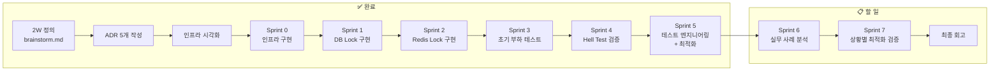

# 대규모 트래픽 처리 (동시성 제어 PoC) - How 구조화

**작성일:** 2026-01-15
**최종 업데이트:** 2026-02-02 (Sprint 5 완료)
**기반 문서:** brainstorm.md (2W 정의 완료)
**실행 프로젝트:** [concurrency-control-poc](../../../concurrency-control-poc/)

---

## 2W 요약 (from brainstorm.md)

| 항목 | 내용 |
|------|------|
| **What** | 이직용 기술 검증 토이 프로젝트 (동시성 제어 PoC) |
| **Why** | 네카라쿠배 시니어 백엔드 포지션 - "대규모 트래픽 처리 경험" 증명 |
| **제약 조건** | 1-2달, 혼자 진행, 완성 가능한 범위 |
| **대략적 범위** | PoC (토이 프로젝트, MVP 아님) |

**핵심 목표:**
> "재고 차감 동시성 제어 4가지 방법 성능 비교" ✅ 달성

---

## 1. 메타 다이어그램: 프로젝트 실행 흐름

### 1.1 Sprint 흐름 + Phase 구분

```mermaid
flowchart TD
    subgraph Foundation["✅ Foundation (완료)"]
        S0[Sprint 0<br/>플랫폼 엔지니어링<br/>+ 아키텍처 설계]
    end

    subgraph Phase1Done["✅ Phase 1-1 (완료)"]
        S1[Sprint 1<br/>DB Lock<br/>Pessimistic + Optimistic]
    end

    subgraph Phase1Done2["✅ Phase 1-2 (완료)"]
        S2[Sprint 2<br/>Redis Lock<br/>Distributed + Lua Script]
    end

    subgraph Phase2Done["✅ Phase 2 (완료)"]
        S3[Sprint 3<br/>부하 테스트<br/>High/Extreme Load]
    end

    subgraph Phase3Done["✅ Phase 3 (완료)"]
        S4[Sprint 4<br/>최종 완성<br/>Hell Test + 문서화]
    end

    subgraph Optimization["✅ Phase 4: Optimization (완료)"]
        S5[Sprint 5<br/>한계 돌파<br/>Test Engineering + Tuning]
    end

    subgraph DeepDive["🔄 Phase 5: Deep Dive"]
        S6[Sprint 6<br/>심화 연구/사례 분석]
        S7[Sprint 7<br/>상황별 최적화 검증<br/>(Best Fit Scenarios)]
    end

    S0 -->|Done| S1
    S1 -->|Done| S2
    S2 -->|Done| S3
    S3 -->|Done| S4
    S4 -->|Done| S5
    S5 -.->|Next| S6
    S6 -.->|Next| S7
```

### 1.2 진행 상태 (Timeline View)



---

## 2. 범위 확정

### ✅ In Scope (달성 완료)

| 항목 | 설명 | 상태 |
|------|------|:---:|
| **단일 도메인** | Stock (재고) 관리만 | ✅ |
| **단일 기능** | 재고 차감 (데이터 정합성 보장) | ✅ |
| **4가지 동시성 제어** | Pessimistic Lock, Optimistic Lock, Redis Lock, Lua Script | ✅ |
| **정량 측정** | k6 부하 테스트 (TPS, Latency, Success Rate) | ✅ |
| **문서화** | README + 블로그 포스팅 초안 | ✅ |
| **아키텍처** | Layered Architecture (단순화) | ✅ |
| **인프라** | Docker Compose (MySQL + Redis) | ✅ |
| **최적화** | Virtual Threads 도입, HikariCP/Lettuce Tuning | ✅ |
| **테스트 공학** | 격리 환경(Isolation) 및 목적별 시나리오(Capacity/Contention/Stress) | ✅ |
| **비즈니스 검증** | 에지 케이스(Busy DB)에서의 리소스 보호 효과 측정 | 📋 예정 |

---

## 3. Sprint 계획 및 결과

### Sprint 계획 매트릭스

| Sprint | Phase | 목표 | 결과 |
|--------|-------|------|:---:|
| **Sprint 0** | Foundation | 개발 환경 + 아키텍처 시각화 | ✅ 완료 |
| **Sprint 1** | Phase 1 | DB Lock 구현 | ✅ 완료 |
| **Sprint 2** | Phase 1 | Redis Lock 구현 | ✅ 완료 |
| **Sprint 3** | Phase 2 | 부하 테스트 + 성능 비교 | ✅ 완료 |
| **Sprint 4** | Phase 3 | 최종 완성 + 문서화 | ✅ 완료 |
| **Sprint 5** | Optimization | **한계 돌파 (Virtual Threads + Tuning)** | ✅ 완료 |
| **Sprint 6** | Deep Dive | 심화 연구 (실무 도입 사례) | 🔄 진행 중 |
| **Sprint 7** | Deep Dive | **상황별 최적화 검증 (Best Fit Verification)** | 📋 예정 |

### Sprint별 상세 결과

#### Sprint 5: 한계 돌파 (Optimization) ✅ 완료
(상세 내용 생략...)

---

#### Sprint 6: 심화 연구 (실무 도입 사례) 🔄 진행 중

**목표:** 각 동시성 제어 방식의 실제 현업 도입 사례 연구 및 분석 - **개발 중심 → 운영 중심 전환**
(상세 내용 생략...)

---

#### Sprint 7: 상황별 최적화 검증 (Best Fit Verification) 📋 예정

**목표:** "절대적인 성능 우위는 없다"는 것을 증명하기 위해, 각 방식이 가장 빛나는 **'Best Fit' 시나리오**를 설계하고 검증.

**검증 시나리오 (The Right Tool for the Right Job):**
1.  **Pessimistic Lock:** **"Complex Transaction"**
    *   **상황:** 재고 차감 + 포인트 사용 + 결제 이력 생성 등 복잡한 ACID 트랜잭션.
    *   **가설:** Lua나 Optimistic으로는 구현이 어렵거나 롤백 비용이 크지만, 비관적 락은 가장 안정적으로 처리.
2.  **Optimistic Lock:** **"Read-Heavy"**
    *   **상황:** 쓰기보다 읽기가 압도적으로 많은 상황 (충돌률 1% 미만).
    *   **가설:** 락 오버헤드가 없으므로 비관적/Redis 락보다 높은 TPS 달성.
3.  **Redis Distributed Lock:** **"Resource Protection"**
    *   **상황:** DB CPU가 이미 포화 상태인 경우 (Busy DB).
    *   **가설:** Redis에서 유입량을 조절(Throttling)하여 DB 다운을 막고 안정적인 처리량 유지.
4.  **Lua Script:** **"Atomic Counter"**
    *   **상황:** 로직이 단순한 선착순 100만 건.
    *   **가설:** 압도적인 성능 차이 입증.

---

## 4. 최종 지표 (Quantitative Results Summary)

**[📄 Performance Report V2 (상세 보기)](../reports/performance-v2.md)**

| 시나리오 | 규모 (재고 / 부하) | 최적 방식 (🥇) | p95 Latency | 핵심 인사이트 |
| :--- | :---: | :---: | :---: | :--- |
| **Capacity** | 10,000 / Max | **Lua Script** | **120ms** | DB I/O 병목 제거로 2.5배 성능 향상 |
| **Contention** | 100 / 5,000 VUs | **Lua Script** | **1.06s** | 품절 이후 트래픽까지 완벽 방어 |
| **Stress** | 10,000 / 1,000 RPS | **Lua Script** | **3.78ms** | 동일 부하에서 가장 적은 리소스 사용 |

---

**상태:** Sprint 5 완료. PoC의 기술적 검증 목표 100% 달성. 다음 단계로 Sprint 6 심화 연구 진행 가능.
