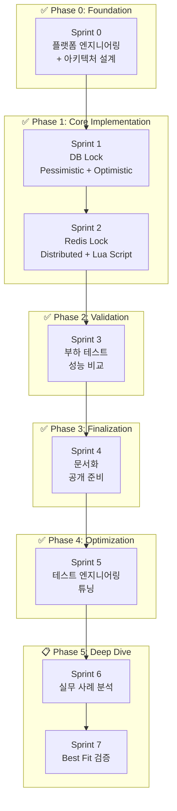
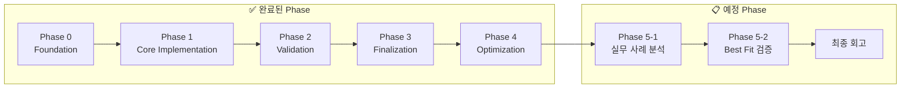

# 대규모 트래픽 처리 (동시성 제어 PoC) - How 구조화

## Quick Guide
- 핵심 결론: 이 문서는 실행 결과 보고서가 아니라 Phase 기반 실행 계획서다.
- 확정 결정: 범위는 Stock 재고 차감 + 4가지 동시성 제어 비교로 고정.
- 진행 원칙: 완료 상태는 Phase 옆 아이콘(`✅`, `📋`)으로만 표기한다.
- 현재 계획: Deep Dive는 운영 사례 분석과 Best Fit 검증(Phase 5)으로 진행한다.
- 리스크: Phase 5 산출물 범위가 넓어지면 문서화 일정이 밀릴 수 있음.

**작성일:** 2026-01-15
**최종 업데이트:** 2026-02-05
**기반 문서:** 2w-brainstorm.md (2W 정의 완료)
**실행 프로젝트:** [concurrency-control-poc](../../../concurrency-control-poc/)

---

## 2W 요약 (from 2w-brainstorm.md)

| 항목 | 내용 |
|------|------|
| **What** | 이직용 기술 검증 토이 프로젝트 (동시성 제어 PoC) |
| **Why** | 네카라쿠배 시니어 백엔드 포지션 - "대규모 트래픽 처리 경험" 증명 |
| **제약 조건** | 1-2달, 혼자 진행, 완성 가능한 범위 |
| **대략적 범위** | PoC (토이 프로젝트, MVP 아님) |

**핵심 목표:**
> "재고 차감 동시성 제어 4가지 방법 성능 비교"

---

## 1. 메타 다이어그램: Phase 실행 계획

### 1.1 Phase 흐름 + Sprint 매핑

### 1.2 Timeline View (계획 기준)

---

## 2. 범위 확정

### ✅ In Scope

| 항목 | 설명 | 상태 |
|------|------|:---:|
| **단일 도메인** | Stock (재고) 관리만 | ✅ |
| **단일 기능** | 재고 차감 (데이터 정합성 보장) | ✅ |
| **4가지 동시성 제어** | Pessimistic Lock, Optimistic Lock, Redis Lock, Lua Script | ✅ |
| **정량 측정** | k6 부하 테스트 (TPS, Latency, Success Rate) | ✅ |
| **문서화** | README + 블로그 포스팅 | ✅ |
| **아키텍처** | Layered Architecture (단순화) | ✅ |
| **인프라** | Docker Compose (MySQL + Redis) | ✅ |
| **최적화** | Virtual Threads, HikariCP/Lettuce 튜닝 | ✅ |
| **비즈니스 검증** | Busy DB 환경 리소스 보호 효과 측정 | 📋 |

### ❌ Out of Scope

| 항목 | 이유 |
|------|------|
| 멀티 모듈(Product/Order/Payment) 확장 | PoC 핵심 목표 대비 과확장 |
| Kafka/EDA 본격 도입 | 결과 해석 복잡도 증가 |
| 실제 PG 연동 | 본 검증 범위 외 |

### ⏸️ Deferred

| 항목 | 결정 조건 |
|------|----------|
| 모니터링 고도화 (Prometheus/Grafana) | Phase 5 결과 검토 후 필요 시 |
| 조회 최적화 별도 PoC | 현재 쓰기 경합 검증 완료 후 분리 |

---

## 3. Phase 계획

### 3.1 Phase 매트릭스

| Phase | Sprint 매핑 | 목표 | 핵심 산출물 | 상태 |
|------|-------------|------|------------|:---:|
| **Phase 0: Foundation** | Sprint 0 | 개발 환경 + 아키텍처 시각화 | Docker Compose, Makefile, ADR, 아키텍처 다이어그램 | ✅ |
| **Phase 1: Core Implementation** | Sprint 1-2 | 4가지 동시성 제어 구현 | DB Lock API, Redis Lock API, Lua Script API, 통합 테스트 | ✅ |
| **Phase 2: Validation** | Sprint 3 | 부하 테스트 + 성능 비교 | k6 스크립트, 성능 비교표, 트레이드오프 분석 | ✅ |
| **Phase 3: Finalization** | Sprint 4 | 문서화 + 외부 공유 준비 | README, 재현 가이드, 블로그 초안 | ✅ |
| **Phase 4: Optimization** | Sprint 5 | 테스트 엔지니어링 + 시스템 튜닝 | Capacity/Contention/Stress 체계, 튜닝 가이드 | ✅ |
| **Phase 5: Deep Dive** | Sprint 6-7 | 운영 관점 분석 + Best Fit 검증 | 운영 사례 리포트, 시나리오별 검증 결과 | 📋 |

### 3.2 Phase 상세

#### Phase 0: Foundation ✅

**목표**
- 비기능적 요구사항을 만족하는 실행 환경 구축
- 구현 전에 구조를 다이어그램으로 고정

**범위**
- 인프라 구성(MySQL, Redis)
- 프로젝트 스캐폴딩 및 ADR 정리

**산출물**
- Docker Compose, Makefile (`up/down/init`)
- ADR 문서 세트
- C4/Sequence 다이어그램

**완료 기준**
- `make up`으로 인프라가 재현 가능
- 다이어그램만으로 시스템 흐름 설명 가능

#### Phase 1: Core Implementation ✅

**목표**
- 재고 차감 시나리오에서 4가지 동시성 제어 방식 구현

**범위**
- DB Lock: Pessimistic, Optimistic
- Redis: Distributed Lock, Lua Script

**산출물**
- 전략별 API 및 공통 호출 인터페이스
- 동시성 통합 테스트
- 기본 비교 가능한 실행 스크립트

**완료 기준**
- 모든 방식이 동일 시나리오로 호출 가능
- 동시 요청에서 데이터 정합성 보장

#### Phase 2: Validation ✅

**목표**
- 4가지 방식의 성능/안정성 차이를 정량화

**범위**
- Capacity, Contention, Stress 테스트
- TPS/Latency/Success Rate 측정

**산출물**
- k6 테스트 스크립트
- 성능 비교 표 및 분석 문서
- 상황별 트레이드오프 정리

**완료 기준**
- "어떤 상황에 어떤 방식"인지 설명 가능한 비교 결과 확보

#### Phase 3: Finalization ✅

**목표**
- 외부 재현성과 전달력을 갖춘 프로젝트 문서 완성

**범위**
- README 개선
- 실행/검증 가이드 정리
- 기술 블로그 초안 구성

**산출물**
- 재현 가능한 Quick Start 문서
- 결과 요약 섹션 및 온보딩 가이드
- 블로그 초안

**완료 기준**
- 타인이 문서만으로 실행/검증 가능
- 핵심 비교 포인트를 문서에서 바로 이해 가능

#### Phase 4: Optimization ✅

**목표**
- 고부하 테스트 신뢰도와 시스템 처리 한계 개선

**범위**
- 테스트 시나리오 체계화
- 런타임/커넥션 튜닝

**산출물**
- Capacity/Contention/Stress 표준 시나리오
- Virtual Threads 및 커넥션풀 튜닝 가이드
- 최적화 비교 리포트

**완료 기준**
- 동일 조건에서 반복 가능한 성능 검증 가능
- 튜닝 전후 차이를 수치로 설명 가능

#### Phase 5: Deep Dive 📋

**목표**
- 구현 관점에서 운영 관점으로 확장
- 절대 우위가 아닌 상황별 Best Fit 제시

**범위**
- Sprint 6: 실무 사례/장애 대응 분석
- Sprint 7: Best Fit 시나리오 검증

**산출물**
- 방식별 운영 사례 리포트
- 시나리오 기반 검증 데이터
- 최종 의사결정 가이드

**완료 기준**
- "상황별 최적 선택"을 사례와 데이터로 설명 가능

---

## 4. 지표 계획

| 시나리오 | 측정 지표 | 기준 |
|------|------|------|
| Capacity | TPS, p95 Latency, Success Rate | 대량 요청 시 처리 한계 비교 |
| Contention | TPS, 재시도 비용, 정합성 | 고경합 상황에서의 방어력 비교 |
| Stress | 평균/최대 지연, 자원 사용량 | 지속 부하에서의 안정성 비교 |
| Best Fit (Phase 5) | 시나리오별 우위 방식 | 절대 우위가 아닌 상황별 적합성 검증 |

---

**상태:** Phase 0~4 완료(✅), Phase 5 계획 진행 중(📋)
