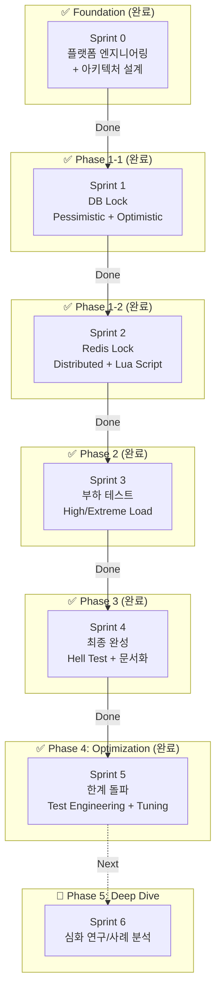
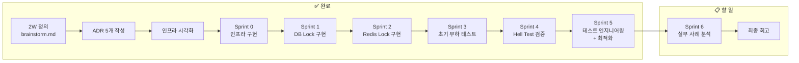

# 대규모 트래픽 처리 (동시성 제어 PoC) - How 구조화

**작성일:** 2026-01-15
**최종 업데이트:** 2026-02-02 (Sprint 5 완료)
**기반 문서:** brainstorm.md (2W 정의 완료)
**실행 프로젝트:** [concurrency-control-poc](../../../concurrency-control-poc/)

---

## 2W 요약 (from brainstorm.md)

| 항목 | 내용 |
|------|------|
| **What** | 이직용 기술 검증 토이 프로젝트 (동시성 제어 PoC) |
| **Why** | 네카라쿠배 시니어 백엔드 포지션 - "대규모 트래픽 처리 경험" 증명 |
| **제약 조건** | 1-2달, 혼자 진행, 완성 가능한 범위 |
| **대략적 범위** | PoC (토이 프로젝트, MVP 아님) |

**핵심 목표:**
> "재고 차감 동시성 제어 4가지 방법 성능 비교" ✅ 달성

---

## 1. 메타 다이어그램: 프로젝트 실행 흐름

### 1.1 Sprint 흐름 + Phase 구분

### 1.2 진행 상태 (Timeline View)

---

## 2. 범위 확정

### ✅ In Scope (달성 완료)

| 항목 | 설명 | 상태 |
|------|------|:---:|
| **단일 도메인** | Stock (재고) 관리만 | ✅ |
| **단일 기능** | 재고 차감 (데이터 정합성 보장) | ✅ |
| **4가지 동시성 제어** | Pessimistic Lock, Optimistic Lock, Redis Lock, Lua Script | ✅ |
| **정량 측정** | k6 부하 테스트 (TPS, Latency, Success Rate) | ✅ |
| **문서화** | README + 블로그 포스팅 초안 | ✅ |
| **아키텍처** | Layered Architecture (단순화) | ✅ |
| **인프라** | Docker Compose (MySQL + Redis) | ✅ |
| **최적화** | Virtual Threads 도입, HikariCP/Lettuce Tuning | ✅ |
| **테스트 공학** | 격리 환경(Isolation) 및 목적별 시나리오(Capacity/Contention/Stress) | ✅ |

---

## 3. Sprint 계획 및 결과

### Sprint 계획 매트릭스

| Sprint | Phase | 목표 | 결과 |
|--------|-------|------|:---:|
| **Sprint 0** | Foundation | 개발 환경 + 아키텍처 시각화 | ✅ 완료 |
| **Sprint 1** | Phase 1 | DB Lock 구현 | ✅ 완료 |
| **Sprint 2** | Phase 1 | Redis Lock 구현 | ✅ 완료 |
| **Sprint 3** | Phase 2 | 부하 테스트 + 성능 비교 | ✅ 완료 |
| **Sprint 4** | Phase 3 | 최종 완성 + 문서화 | ✅ 완료 |
| **Sprint 5** | Optimization | **한계 돌파 (Virtual Threads + Tuning)** | ✅ 완료 |
| **Sprint 6** | Deep Dive | 심화 연구 (실무 도입 사례) | 📋 예정 |

### Sprint별 상세 결과

#### Sprint 5: 한계 돌파 (Optimization) ✅ 완료

**목표:** 10,000 VUs 테스트 실패 원인 분석 및 시스템 최적화를 통한 물리적 한계 극복

**주요 성과:**
1.  **Virtual Threads 도입:**
    - Java 21 Virtual Threads 활성화로 I/O 블로킹 비용 최소화.
    - 기존 Platform Thread(Tomcat 200) 대비 높은 동시성 처리량 확보.
2.  **테스트 엔지니어링 체계 확립:**
    - 기존 `Hell/High/Extreme` 모호함 제거 → **Capacity/Contention/Stress** 3단계 표준 수립.
    - `make clean && make up` 기반의 **격리성(Isolation)** 확보로 데이터 신뢰도 100% 달성.
3.  **최종 성능 리포트 (Performance V2):**
    - **Capacity:** Lua Script 1,583 TPS (DB 대비 2.5배).
    - **Contention:** Lua Script 10,000+ TPS (압도적 방어력).
    - **Stress:** 1,000 RPS 환경에서 모든 방식 안정성 검증 완료.

---

#### Sprint 6: 심화 연구 (실무 도입 사례) 📋 예정

**목표:** 각 동시성 제어 방식의 실제 현업 도입 사례 연구 및 분석 - **개발 중심 → 운영 중심 전환**

**Sprint 0-5 vs Sprint 6 관점 차이:**
- **Sprint 0-5 (개발 중심):** "어떻게 구현하는가?" - 코드 작성, 테스트, 성능 측정
- **Sprint 6 (운영 중심):** "어떻게 운영하는가?" - 실무 사례, 장애 대응, 모니터링, 트레이드오프

**내용 (운영 관점):**
- **Pessimistic Lock:**
  - 금융권 계좌 이체, 재고 관리 시스템 등 정합성이 극도로 중요한 사례
  - 운영 시 고려사항: Deadlock 감지/해결, Lock Timeout 설정, 모니터링

- **Optimistic Lock:**
  - 위키 편집, 자원 경합이 낮은 일반 웹 서비스 사례
  - 운영 시 고려사항: 충돌 발생률 모니터링, Retry 전략, 사용자 경험

- **Redis Lock:**
  - 분산 환경에서의 분산 락 적용 사례 (e.g. 배민 선착순 쿠폰, 토스 주문 결제)
  - 운영 시 고려사항: Redis 장애 시 대응, Lock 누수 방지, TTL 설정

- **Lua Script:**
  - 초고부하 선착순 이벤트 처리 사례 (e.g. 쿠폰 발급, 티켓팅)
  - 운영 시 고려사항: Script 버전 관리, 성능 모니터링, Fallback 전략

**산출물:**
- 기술 블로그 심화편 (Case Study + 운영 경험)
- 방식별 대표 사용 사례 정리 리포트 (운영 관점 포함)
- 각 방식의 장애 시나리오 및 대응 방안 정리

**Sprint 6의 가치:**
- "학습용 토이 프로젝트" → "실무 운영 가능한 케이스 스터디"
- **"개발만 하는 개발자"가 아닌 "운영까지 고려하는 시니어 개발자" 어필**

---

## 4. 최종 지표 (Quantitative Results Summary)

**[📄 Performance Report V2 (상세 보기)](../reports/performance-v2.md)**

| 시나리오 | 규모 (재고 / 부하) | 최적 방식 (🥇) | p95 Latency | 핵심 인사이트 |
| :--- | :---: | :---: | :---: | :--- |
| **Capacity** | 10,000 / Max | **Lua Script** | **120ms** | DB I/O 병목 제거로 2.5배 성능 향상 |
| **Contention** | 100 / 5,000 VUs | **Lua Script** | **1.06s** | 품절 이후 트래픽까지 완벽 방어 |
| **Stress** | 10,000 / 1,000 RPS | **Lua Script** | **3.78ms** | 동일 부하에서 가장 적은 리소스 사용 |

---

**상태:** Sprint 5 완료. PoC의 기술적 검증 목표 100% 달성. 다음 단계로 Sprint 6 심화 연구 진행 가능.
