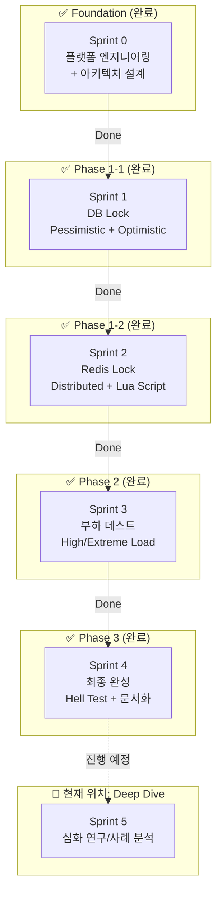

# 대규모 트래픽 처리 (동시성 제어 PoC) - How 구조화

**작성일:** 2026-01-15
**최종 업데이트:** 2026-01-28 (Sprint 4 완료)
**기반 문서:** brainstorm.md (2W 정의 완료)
**실행 프로젝트:** [concurrency-control-poc](../../../concurrency-control-poc/)

---

## 2W 요약 (from brainstorm.md)

| 항목 | 내용 |
|------|------|
| **What** | 이직용 기술 검증 토이 프로젝트 (동시성 제어 PoC) |
| **Why** | 네카라쿠배 시니어 백엔드 포지션 - "대규모 트래픽 처리 경험" 증명 |
| **제약 조건** | 1-2달, 혼자 진행, 완성 가능한 범위 |
| **대략적 범위** | PoC (토이 프로젝트, MVP 아님) |

**핵심 목표:**
> "재고 차감 동시성 제어 4가지 방법 성능 비교" ✅ 달성

---

## 1. 메타 다이어그램: 프로젝트 실행 흐름

### 1.1 Sprint 흐름 + Phase 구분

### 1.2 진행 상태 (Timeline View)

---

## 2. 범위 확정

### ✅ In Scope (달성 완료)

| 항목 | 설명 | 상태 |
|------|------|:---:|
| **단일 도메인** | Stock (재고) 관리만 | ✅ |
| **단일 기능** | 재고 차감 (데이터 정합성 보장) | ✅ |
| **4가지 동시성 제어** | Pessimistic Lock, Optimistic Lock, Redis Lock, Lua Script | ✅ |
| **정량 측정** | k6 부하 테스트 (TPS, Latency, Success Rate) | ✅ |
| **문서화** | README + 블로그 포스팅 초안 | ✅ |
| **아키텍처** | Layered Architecture (단순화) | ✅ |
| **인프라** | Docker Compose (MySQL + Redis) | ✅ |

---

## 3. Sprint 계획 및 결과

### Sprint 계획 매트릭스

| Sprint | Phase | 목표 | 결과 |
|--------|-------|------|:---:|
| **Sprint 0** | Foundation | 개발 환경 + 아키텍처 시각화 | ✅ 완료 |
| **Sprint 1** | Phase 1 | DB Lock 구현 | ✅ 완료 |
| **Sprint 2** | Phase 1 | Redis Lock 구현 | ✅ 완료 |
| **Sprint 3** | Phase 2 | 부하 테스트 + 성능 비교 | ✅ 완료 |
| **Sprint 4** | Phase 3 | 최종 완성 + 문서화 | ✅ 완료 |
| **Sprint 5** | Deep Dive | 심화 연구 (실무 도입 사례) | 📋 예정 |

### Sprint별 상세 결과

#### Sprint 4: 최종 완성 + 문서화 ✅ 완료

**목표:** 극한 경합(Hell Test) 검증 후 프로젝트 완성 및 외부 공개 준비

**산출물:**
- [x] Hell Test 결과 리포트 (재고 100개 vs 5,000 VUs)
- [x] README.md 전면 개편 (Quick Start 및 성능 요약 표 포함)
- [x] 블로그 포스팅 초안 작성 (`docs/blog-post-draft.md`)
- [x] 프로젝트 구조 정리 및 v1.0.0 태그 생성

**완료 기준:**
- README만 보고 5분 안에 실행 가능 확인 ✅
- 모든 성능 시나리오(High, Extreme, Hell, Recovery) 데이터 확보 ✅

---

#### Sprint 5: 심화 연구 (실무 도입 사례) 📋 예정

**목표:** 각 동시성 제어 방식의 실제 현업 도입 사례 연구 및 분석 - **개발 중심 → 운영 중심 전환**

**Sprint 0-4 vs Sprint 5 관점 차이:**
- **Sprint 0-4 (개발 중심):** "어떻게 구현하는가?" - 코드 작성, 테스트, 성능 측정
- **Sprint 5 (운영 중심):** "어떻게 운영하는가?" - 실무 사례, 장애 대응, 모니터링, 트레이드오프

**내용 (운영 관점):**
- **Pessimistic Lock:**
  - 금융권 계좌 이체, 재고 관리 시스템 등 정합성이 극도로 중요한 사례
  - 운영 시 고려사항: Deadlock 감지/해결, Lock Timeout 설정, 모니터링

- **Optimistic Lock:**
  - 위키 편집, 자원 경합이 낮은 일반 웹 서비스 사례
  - 운영 시 고려사항: 충돌 발생률 모니터링, Retry 전략, 사용자 경험

- **Redis Lock:**
  - 분산 환경에서의 분산 락 적용 사례 (e.g. 배민 선착순 쿠폰, 토스 주문 결제)
  - 운영 시 고려사항: Redis 장애 시 대응, Lock 누수 방지, TTL 설정

- **Lua Script:**
  - 초고부하 선착순 이벤트 처리 사례 (e.g. 쿠폰 발급, 티켓팅)
  - 운영 시 고려사항: Script 버전 관리, 성능 모니터링, Fallback 전략

**산출물:**
- 기술 블로그 심화편 (Case Study + 운영 경험)
- 방식별 대표 사용 사례 정리 리포트 (운영 관점 포함)
- 각 방식의 장애 시나리오 및 대응 방안 정리

**Sprint 5의 가치:**
- "학습용 토이 프로젝트" → "실무 운영 가능한 케이스 스터디"
- **"개발만 하는 개발자"가 아닌 "운영까지 고려하는 시니어 개발자" 어필**

---

## 4. 최종 지표 (Quantitative Results Summary)

| 시나리오 | 최적 방식 (🥇) | p95 Latency | TPS (Max) | 정합성 |
| :--- | :---: | :---: | :---: | :---: |
| **High Load** | **Lua Script** | 7.45ms | 834 req/s | ✅ |
| **Extreme Load** | **Pessimistic** | 4.05ms | 834 req/s | ✅ |
| **Hell Test** | **Lua Script** | 1.12s | 3,518 req/s | ✅ |

---

**상태:** Sprint 4 완료 및 v1.0.0 릴리스 완료. 다음 단계로 Sprint 5 심화 연구 진행 가능.
