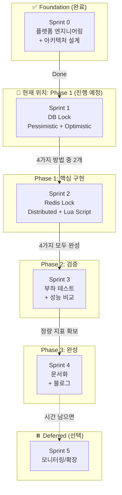
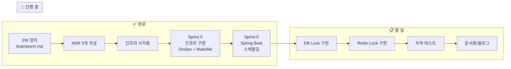

# 대규모 트래픽 처리 (동시성 제어 PoC) - How 구조화

**작성일:** 2026-01-15
**기반 문서:** brainstorm.md (2W 정의 완료)
**실행 프로젝트:** [concurrency-control-poc](../../../concurrency-control-poc/)

---

## 2W 요약 (from brainstorm.md)

| 항목 | 내용 |
|------|------|
| **What** | 이직용 기술 검증 토이 프로젝트 (동시성 제어 PoC) |
| **Why** | 네카라쿠배 시니어 백엔드 포지션 - "대규모 트래픽 처리 경험" 증명 |
| **제약 조건** | 1-2달, 혼자 진행, 완성 가능한 범위 |
| **대략적 범위** | PoC (토이 프로젝트, MVP 아님) |

**핵심 목표:**
> "재고 차감 동시성 제어 4가지 방법 성능 비교"

---

## 1. 메타 다이어그램: 프로젝트 실행 흐름

### 1.1 Sprint 흐름 + Phase 구분

### 1.2 진행 상태 (Timeline View)

---

## 2. 범위 확정

### ✅ In Scope (이번에 한다)

| 항목 | 설명 |
|------|------|
| **단일 도메인** | Stock (재고) 관리만 |
| **단일 기능** | 재고 차감 (데이터 정합성 보장) |
| **4가지 동시성 제어** | Pessimistic Lock, Optimistic Lock, Redis Lock, Lua Script |
| **정량 측정** | k6 부하 테스트 (TPS, Latency, Success Rate) |
| **문서화** | README + 블로그 포스팅 |
| **아키텍처** | Layered Architecture (단순화) |
| **인프라** | Docker Compose (MySQL + Redis) |

### ❌ Out of Scope (이번에 안 한다)

| 항목 | 이유 |
|------|------|
| 멀티 모듈 (Product, Order, Payment) | 단일 모듈로 충분, 오버엔지니어링 방지 |
| 헥사고날 아키텍처 | PoC에 불필요, 레이어드로 충분 |
| Kafka/EDA | 동시성 검증에 방해, 범위 확장 위험 |
| 비즈니스 로직 (장바구니, 주문 취소) | 기술 검증에 불필요 |
| 실제 PG 연동 | Mock으로 충분 |
| Zookeeper 기반 Lock | 4가지로 범위 제한 |

### ⏸️ Deferred (나중에 결정)

| 항목 | 결정 조건 |
|------|----------|
| 모니터링 (Prometheus + Grafana) | Sprint 4 완료 후 시간 여유 있으면 |
| 조회 최적화 PoC | Phase 2 프로젝트로 분리 |
| Kafka 비동기 처리 | Phase 2 프로젝트로 분리 |

---

## 3. Sprint 계획

### Sprint 계획 매트릭스

| Sprint | Phase | 목표 | 핵심 산출물 |
|--------|-------|------|------------|
| **Sprint 0** | Foundation | 개발 환경 + 아키텍처 시각화 | Docker Compose, ADR 5개, 다이어그램 |
| **Sprint 1** | Phase 1 | DB Lock 구현 | Stock Domain, Pessimistic/Optimistic API |
| **Sprint 2** | Phase 1 | Redis Lock 구현 | Redis Lock, Lua Script API |
| **Sprint 3** | Phase 2 | 부하 테스트 + 성능 비교 | k6 스크립트 4개, 성능 비교 표 |
| **Sprint 4** | Phase 3 | 문서화 + 블로그 | README, 블로그 포스팅, 재현 가이드 |
| **Sprint 5** | Deferred | (선택) 확장 | 모니터링 또는 추가 PoC |

### Sprint별 상세

#### Sprint 0: Foundation (현재 진행 중)

**목표:** 비기능적 요구사항 충족 + 아키텍처 시각화

**Iteration 구조:**
1. Iteration 1: 인프라 시각화 → 구현
2. Iteration 2: 애플리케이션 구조 시각화 → 스캐폴딩
3. Iteration 3: 전체 시스템 시각화 + 문서화

**산출물:**
- [x] Docker Compose (MySQL + Redis)
- [x] Makefile (make up/down/init)
- [x] ADR 5개
- [x] 아키텍처 다이어그램 (C4, Sequence 4종)
- [x] README 초안

**완료 기준:**
- `make up` 실행 시 MySQL + Redis 정상 동작
- 다이어그램을 보고 누구나 시스템 이해 가능

---

#### Sprint 1: DB Lock 구현

**목표:** MySQL 기반 동시성 제어 2가지 구현 및 검증

**산출물:**
- Stock Domain + 단위 테스트
- Pessimistic Lock API (`@Lock(PESSIMISTIC_WRITE)`)
- Optimistic Lock API (`@Version`)
- 통합 테스트 (동시성 시나리오)
- Swagger API 문서

**완료 기준:**
- 100명이 동시에 요청해도 재고가 정확히 차감됨

---

#### Sprint 2: Redis Lock 구현

**목표:** Redis 기반 동시성 제어 2가지 구현 및 검증

**산출물:**
- Redis Distributed Lock (Redisson)
- Redis Lua Script (원자적 연산)
- 4가지 API 모두 통합 테스트

**완료 기준:**
- 4가지 API 모두 Swagger로 호출 가능
- Lua Script가 가장 빠름을 직관적으로 확인

---

#### Sprint 3: 부하 테스트 + 성능 비교

**목표:** k6 부하 테스트로 정량 지표 측정 및 비교

**산출물:**
- k6 스크립트 4개
- 성능 비교 표 (TPS, Latency, Success Rate)
- 트레이드오프 분석 문서
- 실무 적용 가이드

**완료 기준:**
- "어떤 상황에 어떤 방법을 쓸 것인가" 명확히 정리됨

---

#### Sprint 4: 문서화 + 블로그

**목표:** 프로젝트 완성 및 외부 공개 준비

**산출물:**
- README.md 완성
- 블로그 포스팅
- 온보딩 가이드

**완료 기준:**
- 다른 사람이 README만 보고 프로젝트 실행 가능
- 블로그 글을 읽고 4가지 방법의 차이 이해 가능

---

## 4. 평가 지표

### 정량 지표 (Quantitative)

#### 성능 지표

| 지표 | 측정 방법 | 목표 |
|------|----------|------|
| **TPS** | k6 부하 테스트 | 4가지 방법별 측정 |
| **Latency** | p50, p95, p99 | 4가지 방법별 측정 |
| **Success Rate** | 데이터 정합성 | 재고가 음수가 되지 않음 |
| **동시 사용자** | 100, 1000, 10000 VU | 시나리오별 측정 |

#### 예상 결과 (가설)

| Method | TPS | p95 Latency | Success Rate | 적합한 상황 |
|--------|-----|-------------|--------------|------------|
| Pessimistic Lock | ~1,200 | ~85ms | 100% | 강한 정합성 필요 |
| Optimistic Lock | ~3,500 | ~45ms | ~92% | 충돌 적고 재시도 가능 |
| Redis Lock | ~5,000 | ~30ms | 100% | 분산 환경, 빠른 처리 |
| Lua Script | ~8,000 | ~20ms | 100% | 초고속, DB 동기화 불필요 |

#### 완성도 지표

| 지표 | 목표 |
|------|------|
| 테스트 커버리지 | 핵심 로직 100% |
| ADR 문서 | 5개 이상 |
| README 완성도 | 30분 안에 실행 가능 |

### 정성 지표 (Qualitative)

#### 재현 가능성
- [ ] README만 보고 프로젝트 실행 가능?
- [ ] Docker Compose로 즉시 환경 구성?
- [ ] k6 스크립트로 바로 부하 테스트 가능?

#### 명확한 결론
- [ ] "어떤 상황에 어떤 방법"이 명확히 정리됨?
- [ ] 트레이드오프 분석이 있음?
- [ ] 실무 적용 가이드가 있음?

#### 면접 어필
- [ ] 정량 데이터 기반 기술 선택 설명 가능?
- [ ] Why/What/How가 문서화됨?
- [ ] 블로그 포스팅으로 전문성 증명?

---

## 5. ADR 목록

| ADR | 제목 | 상태 |
|-----|------|------|
| ADR-001 | 왜 이 4가지 방법을 비교하는가? | ✅ 완료 |
| ADR-002 | 왜 PoC 범위로 축소했는가? | ✅ 완료 |
| ADR-003 | 왜 시각화를 먼저 하는가? | ✅ 완료 |
| ADR-004 | 왜 MySQL과 Redis를 선택했는가? | ✅ 완료 |
| ADR-005 | 왜 Layered Architecture를 선택했는가? | ✅ 완료 |

---

## 6. 관련 문서

- **2W 정의:** [brainstorm.md](./brainstorm.md)
- **실행 프로젝트:** [concurrency-control-poc](../../../concurrency-control-poc/)
- **Sprint 계획:** [.agile/sprints/](../../../concurrency-control-poc/.agile/sprints/)
- **ADR:** [docs/adr/](../../../concurrency-control-poc/docs/adr/)

---

**최종 업데이트:** 2026-01-22
**상태:** Sprint 0 완료 (Foundation 구축 끝) → Sprint 1 대기
--- End of content ---
